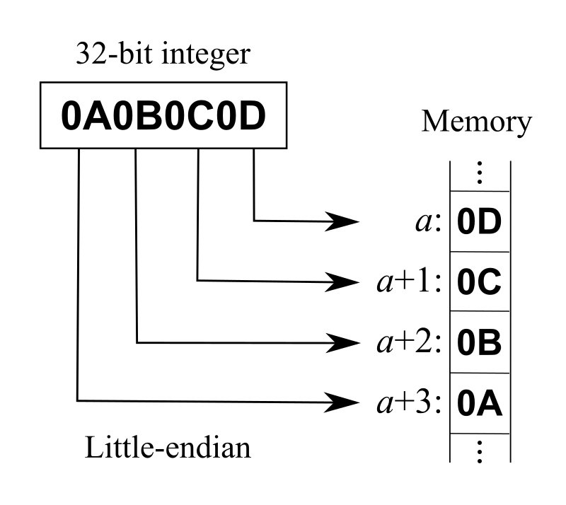

## C++ 面试突破

[toc]

### 1, C++ 编译与内存相关

本章将重点涉及以下高频知识点：

* [C++ 内存管理](https://leetcode.cn/leetbook/read/cmian-shi-tu-po/vv6a76/)
* [堆与栈](https://leetcode.cn/leetbook/read/cmian-shi-tu-po/vvkr02/)
* [变量定义与生存周期](https://leetcode.cn/leetbook/read/cmian-shi-tu-po/vvg9wc/)
* [内存对齐](https://leetcode.cn/leetbook/read/cmian-shi-tu-po/vvzhvi/)
* [智能指针简介与使用](https://leetcode.cn/leetbook/read/cmian-shi-tu-po/vv16rj/)
* [智能指针的创建](https://leetcode.cn/leetbook/read/cmian-shi-tu-po/vvy8ot/)
* [编译与链接](https://leetcode.cn/leetbook/read/cmian-shi-tu-po/vvqvi5/)
* [大端与小端](https://leetcode.cn/leetbook/read/cmian-shi-tu-po/vvzbne/)
* [内存泄漏](https://leetcode.cn/leetbook/read/cmian-shi-tu-po/vvs1ag/)
* [内存泄漏检测与预防](https://leetcode.cn/leetbook/read/cmian-shi-tu-po/vv4zmv/)
* [include &#34; &#34; 和 &lt;&gt; 的区别](https://leetcode.cn/leetbook/read/cmian-shi-tu-po/vvcier/)

#### 01. C++ 内存管理 5

面试高频指数：★★★★★

1. `ELF` 文件:
   可执行与可链接格式 `(Executable and Linkable Format)` 是一种用于可执行文件、目标代码、共享库和核心转储 `（core dump）` 的标准文件格式，每个 ELF**ELF** 文件都由一个 `ELF header` 和紧跟其后的文件数据部分组成，可以参考 ELF**ELF** 文件的构成如下:

   

   我们可以看到可执行程序内部都是分段进行存储的。

* `.text section`：代码段。通常存放已编译程序的机器代码，一般操作系统加载后，这部分是只读的。
* `.rodatasection`：只读数据段。此段的数据不可修改，存放程序中会使用的常量。比如程序中的常量字符串 "aasdasdaaasdasd"**"aasdasdaaasdasd"**。
* `.datasection`：数据段。主要用于存放已初始化的全局变量、常量。
* .`bsssection`: `bss` 段。该段主要存储未初始化全局变量，仅是占位符，不占据任何实际磁盘空间。目标文件格式区分初始化和非初始化是为了空间效率。

操作系统在加载 `ELF` 文件时会将按照标准依次读取每个段中的内容，并将其加载到内存中，同时为该进程分配栈空间，并将 `pc` 寄存器指向代码段的起始位置，然后启动进程。

2. 内存分区：
   `C++` 程序在运行时也会按照不同的功能划分不同的段，`C++` 程序使用的内存分区一般包括：栈、堆、全局/静态存储区、常量存储区、代码区。

* **栈** ：目前绝大部分 CPU 体系都是基于栈来运行程序，栈中主要存放函数的局部变量、函数参数、返回地址等，栈空间一般由操作系统进行默认分配或者程序指定分配，栈空间在进程生存周期一直都存在，当进程退出时，操作系统才会对栈空间进行回收。
* **堆** ：动态申请的内存空间，就是由 `malloc` 函数或者 `new` 函数分配的内存块，由程序控制它的分配和释放，可以在程序运行周期内随时进行申请和释放，如果进程结束后还没有释放，操作系统会自动回收。~我们可以利用~
* **全局区/静态存储区** ：主要为 `.bss` 段和 `.data` 段，存放全局变量和静态变量，程序运行结束操作系统自动释放，在 `C` 中，未初始化的放在 `.bss` 段中，初始化的放在 `.data` 段中，`C++` 中不再区分了。
* **常量存储区** ：`.rodata 段`，存放的是常量，不允许修改，程序运行结束自动释放。
* **代码区** ：`.text 段`，存放代码，不允许修改，但可以执行。编译后的二进制文件存放在这里。

我们参考常见的 Linux**Linux** 操作系统下的内存分布图如下:

从操作系统的本身来讲，以上存储区在该程序内存中的虚拟地址分布是如下形式（虚拟地址从低地址到高地址，实际的物理地址可能是随机的）：.text→.data→.bss→heap→unused→stack→⋯**.text**→**.data**→**.bss**→**heap**→**unused**→**stack**→**⋯**。


* **程序实例** ：
  以下为详细的程序实例，当然可以通过 GDB 工具来查看具体的每个变量的存放地址。
* C++

<pre><div class="md-btns"><button class="md-btn-copy" title="undefined"><i></i></button></div><code>#include <iostream>
  using namespace std;
  /*
  说明：C++ 中不再区分初始化和未初始化的全局变量、静态变量的存储区，如果非要区分下述程序标注在了括号中
  */
  int g_var = 0; // g_var 在全局区（.data 段）
  char *gp_var;  // gp_var 在全局区（.bss 段）

  int main()
  {
      int var;                    // var 在栈区
      char *p_var;                // p_var 在栈区
      char arr[] = "abc";         // arr 为数组变量，存储在栈区；"abc"为字符串常量，存储在常量区
      char *p_var1 = "123456";    // p_var1 在栈区；"123456"为字符串常量，存储在常量区
      static int s_var = 0;       // s_var 为静态变量，存在静态存储区（.data 段）
      p_var = (char *)malloc(10); // 分配得来的 10 个字节的区域在堆区
      free(p_var);
      return 0;
  }
  </code></pre>

  参考资料：

* [How programs get run: ELF binaries](https://leetcode.cn/link/?target=https://lwn.net/Articles/631631/)
* [Memory Layout of C Programs](https://leetcode.cn/link/?target=https://www.***.org/memory-layout-of-c-program/?ref=lbp)

#### 02. 堆与栈 5

面试高频指数：★★★★★

1. 栈：
   首先需要详细了解计算机系统中的 「[Stack machine](https://leetcode.cn/link/?target=https://www.cp.eng.chula.ac.th/~prabhas//teaching/ca/stack.htm)」的基本概念，了解程序中函数的调用过程。每次在调用函数时，会按照从右向左的顺序依次将函数调用参数压入到栈中，并在栈中压入返回地址与当前的栈帧，然后跳转到调用函数内部，`pc` 跳转函数内部执行该函数的指令，在此不再展开叙述，可以详细参考许多关于栈模型的资料。


 **程序示例** ：我们可以在 `gdb` 下查看分配的栈的空间以及当前栈上分配的元素。

* 我们编写如下程序：

```cpp
#include 
```

* > 我们使用调试工具「[GDB**GDB**](https://leetcode.cn/link/?target=https://sourceware.org/gdb/download/onlinedocs/gdb.pdf)」查看程序的堆栈信息，以及当前堆中的变量信息如下：
  >
  > ```
  > $ gdb d
  > (gdb) b main
  > Breakpoint 1 at 0x81d: file d.cpp, line 10.
  > (gdb) r
  > Starting program: /mnt/c/work/leetcode/d
  >
  > Breakpoint 1, main () at d.cpp:10
  > 10      {
  > (gdb) bt full
  > #0  main () at d.cpp:10
  >         var = <optimized out>
  >         p_var = 0x8000730 <_start> "1\355I\211\321^H\211\342H\203\344\360PTL\215\005\n\002"
  >         arr = "\377\177\000"
  >         p_var1 = 0x80008e0 <__libc_csu_init> "AWAVI\211\327AUATL\215%\206\004 "
  >         s_var = 0
  > (gdb) info reg
  > rax            0x8000815        134219797
  > rbx            0x0      0
  > rcx            0x100    256
  > rdx            0x7ffffffedd28   140737488280872
  > rsi            0x7ffffffedd18   140737488280856
  > rdi            0x1      1
  > rbp            0x7ffffffedc30   0x7ffffffedc30
  > rsp            0x7ffffffedc10   0x7ffffffedc10
  > r8             0x7ffffefdcd80   140737471434112
  > r9             0x0      0
  > r10            0x6      6
  > r11            0x7fffff1316d0   140737472829136
  > r12            0x8000730        134219568
  > r13            0x7ffffffedd10   140737488280848
  > r14            0x0      0
  > r15            0x0      0
  > rip            0x800081d        0x800081d <main()+8>
  > eflags         0x202    [ IF ]
  > cs             0x33     51
  > ss             0x2b     43
  > ds             0x0      0
  > es             0x0      0
  > fs             0x0      0
  > gs             0x0      0
  > (gdb)
  >
  > ```
  >
* 我们知道 rsp**rsp** 寄存器存放的地址即为当前的栈顶，rbp**rbp** 寄存器存放的地址即为当前的栈帧，与 rbp**rbp** 寄存器相邻的位置存放的数据即为函数的返回地址与调用函数的栈帧，通过以上信息我们即可获取函数的调用关系。
* **栈溢出** :
  一般情况操作系统为每个进程会固定栈空间的大小：

<pre><div class="md-btns"><button class="md-btn-copy" title="undefined"><i></i></button></div><code>$<span class="bash"> ulimit -s </span>
  8192
  </code></pre>

  当然实际情况，我们可以根据自己的需要来分配每个进程的栈空间。在实际编写程序时，如果出现两个函数互相调用或者递归无退出条件时，此时栈空间的就会无限增长。
  当然实际的栈的分配与应用较为复杂，需要详细阅读操作系统的相关材料，栈一般还分为内核栈与用户栈，在栈顶会有一个特殊的内存页 `guard`，当栈一旦越界访问该特殊的 `guard` 页时，则会出现栈溢出的错误。

2. 堆：
   当程序在运行时，需要动态申请额外的内存来存放相应的数据和变量，此时就需要用到堆。堆的内存空间一般由操作系统或者专门内存程序来管理的。在 `C/C++` 一般用 `malloc` 或者 `new` 来从堆中申请内存，使用 `free` 或者 `delete` 来释放空间，空间释放后会有操作系统进行回收。当然在实际的程序运行中动态内存管理非常复杂，会有许多非常复杂的技巧来处理。
3. 堆与栈的优缺点：

* **申请方式** ：栈中存放的变量在编译时由编译器为其在栈上分配了空间，即程序编译后该变量在栈中使用的内存即确定，释放时也由于函数调用的返回，栈的空间会自动进行回收。堆中存放的变量由程序运行时决定的，会有操作系统或者内存管理模块来进行分配的。
* **申请后系统响应** ：
* 分配栈空间时如果剩余空间大于申请空间则分配成功，否则分配失败栈溢出，绝大多数情况下，栈的空间较小，一般栈上分配的变量不会占用太大的空间，且当函数返回时，当前栈帧中的变量生存周期会结束；申请堆空间，堆在内存中呈现的方式类似于链表（记录空闲地址空间的链表），在链表上寻找第一个大于申请空间的节点分配给程序，将该节点从链表中删除，大多数系统中该块空间的首地址存放的是本次分配空间的大小，便于释放，将该块空间上的剩余空间再次连接在空闲链表上，堆上可以分配较大的空间，如果不对申请的内存进行释放，则堆上存储的变量生存周期一直存在，直到当前进程退出。
* 栈在内存中是连续的一块空间（向低地址扩展）最大容量是系统预定好的，且只能被当前的线程访问；堆在内存中的空间（向高地址扩展）是不连续的，中间允许有间隔，堆中的内存并不是线程安全的，同一进程的线程都都可访问。
* **申请效率** ：栈是有系统自动分配，申请效率高，但程序员无法控制；堆是由程序员主动申请，效率低，使用起来方便但是容易产生碎片。
  存放的内容：栈中存放的是局部变量，函数的参数；堆中存放的内容由程序员控制。

4. 实际的内存管理
   实际的内存管理可能更为复杂，一般分为两级内存管理。

* 操作系统按照段页式来管理内存，当需要创建新的进程或者线程时，操作系统会为新创建的进程分配物理页，当运行的进程需要更多的内存时，操作系统也会为其分配新的物理页并将其映射到该进程的虚拟地址空间中。
* 程序运行时，每个程序都含有一个内存管理的子程序，专门负责程序中的内存申请和释放，其中的技巧可能非常复杂，并且涉及许多内存分配的算法。

参考资料：

* [Stack machine](https://leetcode.cn/link/?target=https://www.cp.eng.chula.ac.th/~prabhas//teaching/ca/stack.htm)
* [Memory Management: Stack And Heap](https://leetcode.cn/link/?target=https://icarus.cs.weber.edu/~dab/cs1410/textbook/4.Pointers/memory.html)
* [Stack vs Heap Memory Allocation](https://leetcode.cn/link/?target=https://www.***.org/stack-vs-heap-memory-allocation/?ref=gcse)
* [GDB](https://leetcode.cn/link/?target=https://sourceware.org/gdb/download/onlinedocs/gdb.pdf)
* [Dynamic Memory Allocation and Fragmentation in C and C++](https://leetcode.cn/link/?target=https://www.design-reuse.com/articles/25090/dynamic-memory-allocation-fragmentation-c.html)
* [从操作系统内存管理来说，malloc申请一块内存的背后原理是什么？](https://leetcode.cn/link/?target=https://www.zhihu.com/question/33979489)

#### 03. 变量定义与生存周期 5

面试高频指数：★★★★★

`C/C++` 变量有两个非常重要的属性：作用域与生命周期，这两个属性代表从时间和空间两个不同的维度来描述一个变量。

1. 作用域：
   作用域即一个变量可以被引用的范围，常见的作用域可分为 6 种：全局作用域，局部作用域，语句作用域，类作用域，命名空间作用域和文件作用域。从作用域来来看：

* **全局变量** ：具有全局作用域。全局变量只需在一个源文件中定义，就可以作用于所有的源文件。其他不包含全局变量定义的源文件需要用 `extern` 关键字再次声明这个全局变量。
* **静态全局变量** ：具有文件作用域。它与全局变量的区别在于如果程序包含多个文件的话，它作用于定义它的文件里，不能作用到其它文件里，即被 `static` 关键字修饰过的变量具有文件作用域。这样即使两个不同的源文件都定义了相同名字的静态全局变量，它们也是不同的变量。
* **局部变量** ：具有局部作用域。它是自动对象（`auto`），在程序运行期间不是一直存在，而是只在函数执行期间存在，函数的一次调用执行结束后，变量被撤销，其所占用的内存也被收回，局部变量对于函数外部的程序来说是不可见的。当然内部实际更复杂，实际是以 `{}` 为作用域的。
* **静态局部变量** ：具有局部作用域。它只被初始化一次，自从第一次被初始化直到程序运行结束都一直存在，它和全局变量的区别在于全局变量对所有的函数都是可见的，而静态局部变量只对定义自己的函数体始终可见, 只有定义该变量的函数内部可以使用访问和修改该变量。
  比如以下文件定义
* **程序实例** ：
  以下为详细的程序实例 `a.cpp, b.cpp`，分别对应的变量定义。

- a.cpp

  ```
  #include <iostream>
  using namespace std;
  int g_var = 0; // 全局变量
  static char *gs_var;  // 静态全局变量

  int main()
  {
      int var;                    // 局部变量
      static int s_var = 0;       // 静态局部变量
      return 0;
  }

  ```

* `b.cpp`

  ```
  #include <iostream>
  using namespace std;
  extern int g_var = 0; // 访问全局变量
  // extern static char *gs_var;  无法访问静态全局变量

  int test()
  {
      g_var = 1;
  }

  ```

2. 生命周期：
   生命周期即该变量可以被引用的时间段（生存期表示变量存在的时间）。

* **全局变量** : 全局变量在整个程序运行期间都会一直存在，都可以随时访问，当程序结束时，对应的变量则会自动销毁，内存会被系统回收。
* **局部变量** : 局部变量的生命周期仅限于函数被调用期间，当函数调用结束时，该变量会自动销毁。
* **静态局部变量** ：实际上静态局部变量的作用域仅限于函数内部，它的作用域与局部变量相同，但实际上该变量在程序运行期间是一直存在的，生命周期贯穿于整个程序运行期间。局部静态变量只能被初始化一次。

3. 从分配内存空间看：
   不同生命周期的变量，在程序内存中的分布位置是不一样的。。我们知道程序的内存分为代码区（`.text`）、全局数据区（`.data`，`.bss`，`.rodata`）、堆区（`heap`）、栈区（`stack`），不同的内存区域，对应不同的生命周期。


* 静态变量一般存储在数据段，包括 `data` 段、`bss` 段、`rodata` 段，其中 `data` 存储已经已经初始化的静态变量和全局变量，`bss` 存储未初始化的静态变量与全局变量。这里静态变量包括全局变量，静态全局变量，静态局部变量。
* 局部变量一般存储在栈区或者堆区。

4. 注意：

* 静态变量和栈变量（存储在栈中的变量）、堆变量（存储在堆中的变量）的区别：静态变量会被放在程序的静态数据存储区（`.data` 段，`bss` 段，`rodata` 段）中（静态变量会自动初始化），这样可以在下一次调用的时候还可以保持原来的赋值。而栈变量或堆变量不能保证在下一次调用的时候依然保持原来的值。
* 静态变量和全局变量的区别：静态变量仅在变量的作用范围内可见，实际是依靠编译器来控制作用域。全局变量在整个程序范围内都可可见，只需声明该全局变量，即可使用。
* 全局变量定义在不要在头文件中定义：如果在头文件中定义全局变量，当该头文件被多个文件 `include` 时，该头文件中的全局变量就会被定义多次，编译时会因为重复定义而报错，因此不能再头文件中定义全局变量。一般情况下我们将变量的定义放在 `.cpp` 文件中，一般在 `.h` 文件使用 `extern` 对变量进行声明。

参考资料：

* [Static Keyword in C++](https://leetcode.cn/link/?target=https://www.***.org/static-keyword-cpp/?ref=gcse)
* [Static data members in C++](https://leetcode.cn/link/?target=https://www.***.org/static-data-members-c/?ref=gcse)
* [Static Variables in C](https://leetcode.cn/link/?target=https://www.***.org/static-variables-in-c/?ref=gcse)
* [Storage Classes in C](https://leetcode.cn/link/?target=https://www.***.org/storage-classes-in-c/?ref=lbp)
* [Memory Layout of C Programs](https://leetcode.cn/link/?target=https://www.***.org/memory-layout-of-c-program/?ref=lbp)
* [.bss](https://leetcode.cn/link/?target=https://en.wikipedia.org/wiki/.bss)
* [Data segment](https://leetcode.cn/link/?target=https://en.wikipedia.org/wiki/Data_segment)
* [6.9 — Sharing global constants across multiple files (using inline variables)](https://leetcode.cn/link/?target=https://www.learncpp.com/cpp-tutorial/sharing-global-constants-across-multiple-files-using-inline-variables/)

#### 04. 内存对齐 5

 面试高频指数：★★★★★

1. 什么是内存对齐：
   计算机中内存的地址空间是按照 `byte` 来划分的，从理论上讲对任何类型变量的访问可以从内存中的任意地址开始，但实际情况是：在访问特定类型变量的时候通常在特定的内存地址访问，这就需要对这些数据在内存中存放的位置进行限制，各种类型数据按照一定的规则在空间上排列，而不是顺序的一个接一个的排放，这就是对齐。编译器将程序中的每个 `数据单元` 的地址安排在机器字的整数倍的地址指向的内存之中。
2. 为什么要内存对齐：
   主要是由于 `CPU` 的访问内存的特性决定，`CPU` 访问内存时并不是以字节为单位来读取内存，而是以机器字长为单位，实际机器字长由 `CPU` 数据总线宽度决定的。实际 `CPU` 运行时，每一次控制内存读写信号发生时，`CPU` 可以从内存中读取数据总线宽度的数据，并将其写入到 `CPU` 的通用寄存器中。比如 `32` 位 `CPU`，机器字长为 `4` 字节，数据总线宽度为 `32` 位，如果该 `CPU` 的地址总线宽度也是为 32**3**2 位，则其可以访问的地址空间为 [0,0xffffffff]**[**0**,**0xffffffff**]**。内存对齐的主要目的是为了减少 `CPU` 访问内存的次数，加大 `CPU` 访问内存的吞吐量。假设读取 `8` 个字节的数据，按照每次读取 `4` 个字节的速度，则 `8` 个字节需要 `CPU` 耗费 `2` 次读取操作。`CPU` 始终以字长访问内存，如果不进行内存对齐，很可能增加 `CPU` 访问内存的次数。


比如以上在读取变量 `b` 时，如果不进行内存对齐的话，会导致 `CPU` 读取次数为 `2`，在内存对齐的情况下，只需读取一次即可，当然实际的读取非对齐的内存处理更为复杂，我们参考下图中读取非对齐内存时的数据处理过程：


除了能够减少内存访问次数，增加内存读取的吞吐量以外，还有其他原因：

* 比如某些特定的硬件设备只能存取对齐数据，存取非对齐的数据可能会引发异常，比如对于 `CPU` 中 `SIMD` 指令，则必须要求内存严格对齐；
* 每次内存访问是原子的，如果变量的大小不超过字长，那么内存对齐后，对该变量的访问就是原子的。某些硬件设备不能保证在存取非对齐数据的时候的操作是原子操作，因此此时 `CPU` 需要可能需要读取多次内存，这样就破坏了变量的原子性；
* 相比于存取对齐的数据，存取非对齐的数据需要花费更多的时间，提高内存的访问效率，因为 `CPU` 在读取内存时，是一块一块的读取；
* 某些处理器虽然支持非对齐数据的访问，但会引发对齐陷阱（`alignment trap`）；
* 某些硬件设备只支持简单数据指令非对齐存取，不支持复杂数据指令的非对齐存取。

3. 内存对齐的原则：
   程序中的内存对齐大部分都是由编译器来处理，编译器会自动在内存之间填充字节。结构体中的变量对齐的基本规则如下：

* 结构体变量的首地址能够被其最宽的基本类型成员的长度和对齐基数二者中的较小者所整除；
* 结构体中的 `static` 成员变量不占用结构体的空间，由于静态成员变量在程序初始化时已经在静态存储区分配完成，所有该结构体实例中的静态成员都指向同一个内存区域；

```
struct st {
    char a;
    int b;
    static double c; //静态成员
} T;
cout<<sizeof(st)<<endl;
// 8

```

* 结构体每个成员相对于结构体首地址的偏移量 （`offset`） 都是该成员大小与对齐基数中的较小者的整数倍，如有需要编译器会在成员之间加上填充字节 （`internal padding`）；
* 结构体的总大小为结构体中最宽基本类型成员的长度与对齐基数二者中的较小者的整数倍，如有需要编译器会在最末尾的成员之后加上填充字节 （`trailing padding`）；
* **实例** ：
  我们可以利用 `offset` 宏定义来计算出结构体中每个变量的偏移地址。

```
/*
 说明：程序是在 64 位编译器下测试的
 */
 #include <iostream>
 using namespace std;
 #define offset(TYPE,MEMBER) ((long)&((TYPE *)0)->MEMBER)

 struct A
 {
     short var; // 偏移 0 字节 （内存对齐原则 : short 2 字节 + 填充 2 个字节）
     int var1;  // 偏移 4 字节 （内存对齐原则：int 占用 4 个字节）
     long var2; // 偏移 8 字节 （内存对齐原则：long 占用 8 个字节）
     char var3; // 偏移 16 字节 （内存对齐原则：char 占用 1 个字节 + 填充 7 个字节）
     string s;  // 偏移 24 字节 （string 占用 32 个字节）
 };

 int main()
 {
     string s;
     A ex1;
     cout << offset(A, var) <<endl;
     cout << offset(A, var1) <<endl;
     cout << offset(A, var2) <<endl;
     cout << offset(A, var3) <<endl;
     cout << offset(A, s) <<endl;
     cout << sizeof(ex1) << endl;  // 56 struct
     return 0;
 }


```

我们可以看到运行结果如下:

0
4
8
16
24
56

指定程序对齐规则：
我们可以指定结构体的对齐规则，在某些特定场景下我们需要指定结构体内存进行对齐，比如在发送特定网络协议报文、硬件协议控制、消息传递、硬件寄存器访问时，这时就就需要避免内存对齐，因为双方均按照预先定义的消息格式来进行交互，从而避免不同的硬件平台造成的差异，同时能够将双方传递的数据进行空间压缩，避免不必要的空间浪费。

**programpack** : 我们可以用 `#progma pack(x)` 指定结构体以 �**x** 为单位进行对齐。一般情况下我们可以使用如下:

```
#pragma pack（push）
#pragma pack（x）
// 存放需要 x 对齐方式的数据块
#pragma pack（pop）
```

我们同样指定上述程序以 1**1** 字节对齐，则可以看到结果如下:

```
/*
说明：程序是在 64 位编译器下测试的
*/
#include <iostream>
using namespace std;
#define offset(TYPE,MEMBER) ((long)&((TYPE *)0)->MEMBER)
#pragma pack(push)
#pragma pack(1)
struct A
{
    short var; // 偏移 0 字节 （内存对齐原则 : short 2 字节 + 填充 2 个字节）
    int var1;  // 偏移 4 字节 （内存对齐原则：int 占用 4 个字节）
    long var2; // 偏移 8 字节 （内存对齐原则：long 占用 8 个字节）
    char var3; // 偏移 16 字节 （内存对齐原则：char 占用 1 个字节 + 填充 7 个字节）
    string s;  // 偏移 24 字节 （string 占用 32 个字节）
};
#pragma pack(pop)

int main()
{
    string s;
    A ex1;
    cout << offset(A, var) <<endl;
    cout << offset(A, var1) <<endl;
    cout << offset(A, var2) <<endl;
    cout << offset(A, var3) <<endl;
    cout << offset(A, s) <<endl;
    cout << sizeof(ex1) << endl;  // 56 struct
    return 0;
}

```

运行结果如下:

```
0
2
6
14
15
47
```

** **attribute** ((aligned (n)))** : `__attribute__((aligned (n)))` 让所作用的结构成员对齐在 `n` 字节自然边界上。如果结构中有成员的长度大于 `n`，则按照最大成员的长度来对齐。需要注意的是：内存对齐的对齐数取决于对齐系数和成员的字节数两者之中的较小值。对齐属性的有效性会受到链接器(linker)固有限制的限制，即如果你的链接器仅仅支持 `8` 字节对齐，即使你指定 `16`字节对齐，那么它也仅仅提供 `8` 字节对齐。`__attribute__((packed))` 表示取消结构在编译过程中的优化对齐，按照实际占用字节数进行对齐，这部分属于 `gcc` 中的用法，详细了解详情可以参考 `gcc` 的手册。

**alignof** : `C++ 11` 以后新增 `alignof` 的特性，通过调用 `alignof` 返回当前变量的字节对齐方式。比如以下程序：

```
/*
说明：程序是在 64 位编译器下测试的
*/
#include <iostream>
using namespace std;
#define offset(TYPE,MEMBER) ((long)&((TYPE *)0)->MEMBER)
#pragma pack(push)
#pragma pack(1)
struct A
{
    short var; // 偏移 0 字节 （内存对齐原则 : short 2 字节 + 填充 2 个字节）
    int var1;  // 偏移 4 字节 （内存对齐原则：int 占用 4 个字节）
    long var2; // 偏移 8 字节 （内存对齐原则：long 占用 8 个字节）
    char var3; // 偏移 16 字节 （内存对齐原则：char 占用 1 个字节 + 填充 7 个字节）
    string s;  // 偏移 24 字节 （string 占用 32 个字节）
};
#pragma pack(pop)

int main()
{
    string s;
    A ex1;
    cout << alignof(A) <<endl;
    return 0;
}

```

此时返回结果为 $1$。

4. 小结：
   内存对齐使得程序便于在不同的平台之间进行移植，因为有些硬件平台不能够支持任意地址的数据访问，只能在某些地址处取某些特定的数据，否则会抛出异常；另一方面提高内存的访问效率，因为 `CPU` 在读取内存时，是以块为单位进行读取。

参考资料:

* [Purpose of memory alignment](https://leetcode.cn/link/?target=https://stackoverflow.com/questions/381244/purpose-of-memory-alignment)
* [Memory alignment… run, you fools!](https://leetcode.cn/link/?target=http://blog.virtualmethodstudio.com/2017/03/memory-alignment-run-fools/)
* [Data alignment: Straighten up and fly right](https://leetcode.cn/link/?target=https://web.archive.org/web/20080607055623/http://www.ibm.com/developerworks/library/pa-dalign/)
* [Alignment](https://leetcode.cn/link/?target=https://docs.microsoft.com/en-us/cpp/cpp/alignment-cpp-declarations?view=msvc-170&viewFallbackFrom=vs-2019)
* [内存对齐](https://leetcode.cn/link/?target=http://light3moon.com/2015/01/19/%5B%E8%BD%AC%5D%20%E5%86%85%E5%AD%98%E5%AF%B9%E9%BD%90/)
* [Data structure alignment](https://leetcode.cn/link/?target=https://en.wikipedia.org/wiki/Data_structure_alignment)
* [一文轻松理解内存对齐](https://leetcode.cn/link/?target=https://cloud.tencent.com/developer/article/1727794)
* [What is alignment?](https://leetcode.cn/link/?target=https://www.cs.umd.edu/~meesh/cms***11/website/projects/outer/memory/align.htm)

#### 05. 智能指针简介与使用 5

面试高频指数：★★★★★

1. 智能指针:
   智能指针是为了解决动态内存分配时带来的内存泄漏以及多次释放同一块内存空间而提出的。`C++ 11` 中提供了智能指针的定义，所有关于智能指针的定义可以参考 `<memory>` 头文件。传统的指针在申请完成后，必须要调用 `free` 或者 `delete` 来释放指针，否则容易产生内存泄漏的问题；`smart pointer` 遵循 `RAII` 原则，当 `smart pointer` 对象创建时，即为该指针分配了相应的内存，当对象销毁时，析构函数会自动释放内存。需要注意的是，智能指针不能像普通指针那样支持加减运算。

```
#include <iostream>
using namespace std;

class SmartPtr {
    int* ptr; 
public:
    explicit SmartPtr(int* p = NULL) { ptr = p; }
    ~SmartPtr() { delete (ptr); }
    int& operator*() { return *ptr; }
};

int main()
{
    SmartPtr ptr(new int());
    *ptr = 20;
    cout << *ptr;
    return 0;
}

```

同时 `smart pointer` 重载了 `*` 和 `->` 等操作，使用该对象就像 `C` 语言中的普通指针一样，但是区别于普通指针的它会自动释放所申请的内存资源。以下为智能指针的简单实现：

```
#include <iostream>
using namespace std;

template <class T>
class SmartPtr {
	T* ptr; // Actual pointer
public:
	explicit SmartPtr(T* p = NULL) { ptr = p; }
	~SmartPtr() { delete (ptr); }
	T& operator*() { return *ptr; }
	T* operator->() { return ptr; }
};

int main()
{
	SmartPtr<int> ptr(new int());
	*ptr = 20;
	cout << *ptr;
	return 0;
}

```

按照常用的使用用途，智能指针有三类:

* **unique_ptr** ：独享所有权的智能指针，资源只能被一个指针占有，该指针不能拷贝构造和赋值。但可以进行移动构造和移动赋值构造（调用 `move()` 函数），即一个 `unique_ptr` 对象赋值给另一个 `unique_ptr` 对象，可以通过该方法进行赋值。


如图所示，`object` 资源只能被 `P1` 占有，`P2` 无法对 `object` 有所有权，只能通过移动赋值给 `P2`。如下代码示例:

```
#include <iostream>
using namespace std;
#include <memory>

class Rectangle {
	int length;
	int breadth;

public:
	Rectangle(int l, int b){
		length = l;
		breadth = b;
	}

	int area(){
		return length * breadth;
	}
};

int main(){
	unique_ptr<Rectangle> P1(new Rectangle(10, 5));
	cout << P1->area() << endl; // This'll print 50

	unique_ptr<Rectangle> P2;
	// unique_ptr<Rectangle> P2(P1); // 无法拷贝构造
	// P2 = P1;   // 无法赋值构造
	P2 = move(P1);

	cout << P2->area() << endl;

	// cout<<P1->area()<<endl; // 已经传递，P1 无所有权
	return 0;
}

```

我们可以通过查看源代码看到该函数的拷贝构造函数和赋值构造函数均被禁止，只允许使用移动拷贝构造函数和移动赋值构造函数：

```
// Disable copy from lvalue.不允许复制，体现专属所有权语义
unique_ptr(const unique_ptr&) = delete;
unique_ptr& operator=(const unique_ptr&) = delete;

// Move constructor.体现专属所有权语义和只移型别
// 只允许使用移动拷贝构造函数
// 如果复制一个unique_ptr对象，会将源unique_ptr对象管理的资源release掉
unique_ptr(unique_ptr&& __u) noexcept
: _M_t(__u.release(), std::forward<deleter_type>(__u.get_deleter())) { }

// 这个也是移动拷贝构造函数
// 只是使用的类型是可以隐式转换的其他unique_ptr对象
template<typename _Up, typename _Ep, typename = _Require<
		__safe_conversion_up<_Up, _Ep>,
typename conditional<is_reference<_Dp>::value,
	is_same<_Ep, _Dp>,
	is_convertible<_Ep, _Dp>>::type>>
unique_ptr(unique_ptr<_Up, _Ep>&& __u) noexcept
: _M_t(__u.release(), std::forward<_Ep>(__u.get_deleter()))
{ }

// Assignment，也可以说明是专属所有权语义和只移型别
unique_ptr& operator=(unique_ptr&& __u) noexcept
{
	// __u.release()释放并返回源unique_ptr对象管理的资源
	// reset是将__u.release()返回的资源赋给目标（当前）unique_ptr对象
	reset(__u.release());
	get_deleter() = std::forward<deleter_type>(__u.get_deleter());
	return *this;
}

// 析构函数，调用析构器析构掉管理的资源，并将__ptr指向nullptr
~unique_ptr()
{
	auto& __ptr = _M_t._M_ptr();
	if (__ptr != nullptr)
		get_deleter()(__ptr);
	__ptr = pointer();
}

```

同时我们可以看到 `reset` 重新给其赋值，在获取资源的同时会释放原有的资源。

```
void reset(pointer __p = pointer()) noexcept
{
    using std::swap;
    swap(_M_t._M_ptr(), __p);
    if (__p != pointer() get_deleter()(__p);
}

```

**shared_ptr** ：与 `unique_ptr` 不同的是，`shared_ptr` 中资源可以被多个指针共享，但是多个指针指向同一个资源不能被释放多次，因此使用计数机制表明资源被几个指针共享。


通过 `use_count()` 查看资源的所有者的个数，可以通过 `unique_ptr`、`weak_ptr` 来构造，调用 `release()` 释放资源的所有权，同时将计数减一，当计数减为 `0` 时会自动释放内存空间，从而避免了内存泄漏。特别需要注意的是 `shared_ptr` 并不是线程安全的，但 `shared_ptr` 的计数是原子操作实现的，利用 `atmoic CAS` 指令实现。我们可以看到 `share_ptr` 的内存模型，当引用计数和 `weak count` 同时为 `0` 时，`share_ptr` 对象才会被最终释放掉。


代码示例如下:

```
#include <iostream>
using namespace std;
#include <memory>

class Rectangle {
	int length;
	int breadth;

public:
	Rectangle(int l, int b)
	{
		length = l;
		breadth = b;
	}

	int area()
	{
		return length * breadth;
	}
};
int main()
{

	shared_ptr<Rectangle> P1(new Rectangle(10, 5));
	cout << P1->area() << endl;
	shared_ptr<Rectangle> P2;
	P2 = P1;

	cout << P2->area() << endl; // 50
	cout << P1->area() << endl; // 50
	cout << P1.use_count() << endl; // 2
	return 0;
}

```

我们通过查看 `shared_ptr` 的源代码可以看到如下，`shared_ptr` 实际成员包含两个指针，一个指向对象资源的指针 `ptr`，另一个指向管理区域的指针 `__cntrl_`，具体 `__cntrl_` 指向的区域包括 `deleter`、`allocator`、`shared_ptr` 对象的引用计数、`weak_ptrs` 的对象的引用计数。

```
template<class _Tp>
class shared_ptr {
	typedef _Tp element_type;

private:
	element_type*      __ptr_;
	__shared_weak_count* __cntrl_;

	...
}

```

**weak_ptr** ：指向 `share_ptr` 指向的对象，能够解决由 `shared_ptr` 带来的循环引用问题。与 `shared_ptr` 配合使用，将 `weak_ptr` 转换为 `share_ptr` 时，虽然它能访问 `share_ptr` 所指向的资源但却不享有资源的所有权，不影响该资源的引用计数。有可能资源已被释放，但 `weak_ptr` 仍然存在，`share_ptr` 必须等待所有引用的 `weak_ptr` 全部被释放才会进行释放。因此每次访问资源时都需要判断资源是否有效。


`shared_ptr` 通过引用计数的方式来管理对象，当进行拷贝或赋值操作时，每个 `shared_ptr` 都会记录当前对象的引用计数，当引用计数为0时，内存将被自动释放。当对 `shared_ptr` 赋予新值或者被对象被销毁时，引用计数会递减。但特殊情况出现循环引用时，`shared_ptr` 无法正常释放资源。循环引用，即 `A` 指向 `B`，`B` 指向 `A`，在表示双向关系时，是很可能出现这种情况的。下面的示例代码即为出现了循环引用导致内存无法正常被释放。

```
#include <iostream>
#include <memory>
using namespace std;

class B;

class A {
public:
	shared_ptr<B> b_;
	A() {
		cout << "A constructed!" << endl;
	}
	~A() {
		cout << "A destructed!" << endl;
	}
};

class B {
public:
	shared_ptr<A> a_;
	B() {
		cout << "B constructed!" << endl;
	}
	~B() {
		cout << "B destructed!" << endl;
	}
};

int main()
{
	auto classA = make_shared<A>();
	auto classB = make_shared<B>();
	classA->b_ = classB;
	classB->a_ = classA;
	cout << "A: " << classA.use_count() << endl;
	cout << "B: " << classB.use_count() << endl;
	return 0;
}

```

程序结果运行如下:

A constructed!
B constructed!
A: 2
B: 2

为了解决上述的循环引用问题，才出现了 `weak_ptr`，我们知道 `shared_ptr A` 被赋值给 `shared_ptr B` 时，`A` 的引用计数加 `1`；但是 `shared_ptr A` 被赋值给 `weak_ptr C` 时，`A` 的引用计数不变。`weak_ptr` 在使用时是与 `shared_ptr` 绑定的，`weak_ptr` 不影响对象 `shared_ptr` 的引用计数，`weak_ptr` 可以用来跟踪 `shared_ptr` 对象，当 `shared_ptr` 的对象引用计数为 `0` 时，此时 `shared_ptr` 会释放所占用的对象资源，但 `shared_ptr` 对象本身不会释放，它会等待 `weak_ptrs` 引用计数为 `0` 时，此时才会释放管理区域的内存，而释放 `shared_ptr` 对象本身。上述的循环引用，我们可以将一个对象改为 `weak_ptr` 即可避免循环引用导致的异常。例如下列代码：

```
#include <iostream>
#include <memory>
using namespace std;

class B;

class A {
public:
	shared_ptr<B> b_;
	A() {
		cout << "A constructed!" << endl;
	}
	~A() {
		cout << "A destructed!" << endl;
	}
};

class B {
public:
	weak_ptr<A> a_;
	B() {
		cout << "B constructed!" << endl;
	}
	~B() {
		cout << "B destructed!" << endl;
	}
};

int main()
{
	auto classA = make_shared<A>();
	auto classB = make_shared<B>();
	classA->b_ = classB;
	classB->a_ = classA;
	cout << "A: " << classA.use_count() << endl;
	cout << "B: " << classB.use_count() << endl;
	return 0;
}

```

代码执行结果如下：

A constructed!
B constructed!
A: 1
B: 2
A destructed!
B destructed!

参考资料:

* [Smart Pointers in C++ and How to Use Them](https://leetcode.cn/link/?target=https://www.***.org/smart-pointers-cpp/)
* [std::weak_ptr](https://leetcode.cn/link/?target=https://en.cppreference.com/w/cpp/memory/weak_ptr)
* [std::shared_ptr](https://leetcode.cn/link/?target=https://en.cppreference.com/w/cpp/memory/shared_ptr#Implementation_notes)
* [what-is-a-smart-pointer-and-when-should-i-use-one](https://leetcode.cn/link/?target=https://stackoverflow.com/questions/106508/what-is-a-smart-pointer-and-when-should-i-use-one)
* [当我们谈论shared_ptr的线程安全性时，我们在谈论什么](https://leetcode.cn/link/?target=https://zhuanlan.zhihu.com/p/416289479)
* [循环引用中的shared_ptr和weak_ptr](https://leetcode.cn/link/?target=https://zhuanlan.zhihu.com/p/355812360)

#### 06. 智能指针的创建 5

面试高频指数：★★★★★

1. `make_unique` 与 `make_share`:
   `make_unique` 在 `C++ 14` 以后才被加入到标准的 `C++` 中，`make_shared` 则是 `C++ 11` 中加入的。在 「`《Effective Modern C++》`」 学习笔记之条款二十一：优先选用 `std::make_unique` 和 `std::make_shared`,而非直接 `new`。

* `make_unique`：减少代码量，能够加快编译速度，定义两遍类型时，编译器需要进行类型推导会降低编译速度，某些意外意外情况下可能会导致内存泄漏。但是 `make_unique` 不允许自定析构器，不接受 `std::initializer_list` 对象。

```
auto upw1(std::make_unique<Widget>());
//重复写了两次Widget型别
std::unique_ptr<Widget> upw2(new Widget);

```

`make_shared`：这个主要是可以减少对堆中申请内存的次数，只需要申请一次即可。我们知道 `share_ptr` 的内存模型如下:


当我们使用 `new` 时，我们将 `new` 出的资源指针赋给 `share_ptr` 的 `ptr`, 然后 `share_ptr` 本身还需要再次在堆上申请一块单独的内存作为它的管理区，存放引用计数、用户自定的函数等，因此创建 `shared_ptr` 时需要在堆上申请两次。
`C++ [] std::shared_ptr<Widget>(new Widget);`
当我们使用 `make_share` 时，我们只需要申请一块大的内存，一半用来存储资源，另一半作为管理区, 存放引用计数、用户自定的函数等，此时需要在堆上申请一次即可。
`C++ auto upw1(std::make_unique<Widget>());`
以下为两种方式的对比:


`make_share` 虽然效率高，但是同样不能自定义析构器，同时 `share_ptr` 的对象资源可能会延迟释放，因为此时对象资源与管理区域在同一块内存中，必须要同时释放。

参考资料：

* [why using make_unique rather than unique_ptr](https://leetcode.cn/link/?target=https://zhuanlan.zhihu.com/p/528139040)
* [Differences between std::make_unique and std::unique_ptr with new](https://leetcode.cn/link/?target=https://stackoverflow.com/questions/22571202/differences-between-stdmake-unique-and-stdunique-ptr-with-new)
* [which one is better between make_unique and new](https://leetcode.cn/link/?target=https://www.sololearn.com/Discuss/2595135/which-one-is-better-between-make_unique-and-new)

#### 07. 编译与链接 4

面试高频指数：★★★★☆

1. 为什么需要编译：

* 我们常见的 C/C++**C/C++** 语言，CPU**CPU** 是无法理解的，这就需要将我们编写好的代码最终翻译为机器可执行的二进制指令，编译的过程本质上也即是翻译的过程，当然中间涉及的细节非常复杂。

2. 编译的处理过程：
   编译器读取源文件 `cpp`，并将其翻译为可执行文件「[ELF**ELF**](https://leetcode.cn/link/?target=https://baike.baidu.com/item/ELF/7120560?fr=aladdin)」，ELF**ELF** 文件可以经过操作系统进行加载执行。常见的编译过程分为四个过程：编译预处理、编译、汇编、链接。


* **编译预处理** ：在预编译过程中主要处理源代码中的预处理指令，比如引入头文件（`#include`），去除注释，处理所有的条件编译指令（`#ifdef, #ifndef, #else, #elif, #endif`），宏的替换（`#define`），添加行号，保留所有的编译器指令；
* **编译** ：针对预处理后的文件进行词法分析、语法分析、语义分析、符号汇总、汇编代码生成，并针对程序的结构或者特定的 CPU**CPU** 平台进行优化，其中涉及的过程较为复杂。简单来说编译的过程即为将 `.cpp` 源文件翻译成 `.s` 的汇编代码；
* **汇编** ：将汇编代码 `.s` 翻译成机器指令 `.o` 文件，一个 `.cpp` 文件只会生成一个 `.o` 文件；
* **链接** ：汇编程序生成的目标文件即为 `.o` 文件，单独的 `.o` 文件可能无法执行。因为一个程序可能由多个源文件组成，此时就存在多个 `.o` 文件。文件 `A` 中的函数引用了另一个文件 `B` 中定义的符号或者调用了某个库文件中的函数，这就需要链接处理。那链接的目的就是将这些文件对应的目标文件连接成一个整体，从而生成一个可被操作系统加载执行的 ELF**ELF** 程序文件。链接的过程较为复杂，如有兴趣可以参考：「[Computer Systems: A Programmer&#39;s Perspective](https://leetcode.cn/link/?target=http://csapp.cs.cmu.edu/3e/pieces/preface3e.pdf)」。

3. 静态链接与动态链接:

* **静态链接** ：代码在生成可执行文件时，将该程序所需要的全部外部调用函数全部拷贝到最终的可执行程序文件中，在该程序被执行时，该程序运行时所需要的全部代码都会被装入到该进程的虚拟地址空间中。在 Linux**Linux** 系统下，静态链接库一般以 `.a` 文件，我们可以将多个 `.o` 文件链接成一个静态链接库。静态链接演示如下：
* 定义 `a.cpp` 与 `b.cpp` 如下:

```
// a.cpp
#include <iostream>
#include <vector>

extern int test_static();

int main() {
    test_static();
}

// b.cpp
#include <iostream>
#include <vector>

using namespace std;

int test_static() {
    cout<<"this is test static program!"<<endl;
    return 0;
}

```

* 采用静态链接方式进行编译，并查看编译后的函数:

```shell
$ g++ a.cpp b.cpp -o test
$ objdump -d test
```

* 可以看到里面包含 `main` 函数的调用过程以及 `test_static` 函数的详细定义：
* asm

```
00000000000008b5 <main>:
8b5:   55                      push   %rbp
8b6:   48 89 e5                mov    %rsp,%rbp
8b9:   e8 65 00 00 00          callq  923 <_Z11test_staticv>
8be:   b8 00 00 00 00          mov    $0x0,%eax
8c3:   5d                      pop    %rbp
8c4:   c3                      retq

0000000000000923 <_Z11test_staticv>:
923:   55                      push   %rbp
924:   48 89 e5                mov    %rsp,%rbp
927:   48 8d 35 18 01 00 00    lea    0x118(%rip),%rsi        # a46 <_ZStL19piecewise_construct+0x1>
92e:   48 8d 3d 0b 07 20 00    lea    0x20070b(%rip),%rdi        # 201040 <_ZSt4cout@@GLIBCXX_3.4>
935:   e8 56 fe ff ff          callq  790 <_ZStlsISt11char_traitsIcEERSt13basic_ostreamIcT_ES5_PKc@plt>
93a:   48 89 c2                mov    %rax,%rdx
93d:   48 8b 05 8c 06 20 00    mov    0x20068c(%rip),%rax        # 200fd0 <_ZSt4endlIcSt11char_traitsIcEERSt13basic_ostreamIT_T0_ES6_@GLIBCXX_3.4>
944:   48 89 c6                mov    %rax,%rsi
947:   48 89 d7                mov    %rdx,%rdi
94a:   e8 51 fe ff ff          callq  7a0 <_ZNSolsEPFRSoS_E@plt>
94f:   b8 00 00 00 00          mov    $0x0,%eax
954:   5d                      pop    %rbp
955:   c3                      retq

```

**动态链接** ：代码在生成可执行文件时，该程序所调用的部分程序被放到动态链接库或共享对象的某个目标文件中，链接程序只是在最终的可执行程序中记录了共享对象的名字等一些信息，最终生成的 ELF**ELF** 文件中并不包含这些调用程序二进制指令。在程序执行时，当需要调用这部分程序时，操作系统会从将这些动态链或者共享对象进行加载，并将全部内容会被映射到该进行运行的虚拟地址的空间。在 `Linux` 系统下，动态链接库一般以 `.so` 文件，我们可以将多个 `.o` 文件链接成一个动态链接库。动态链接演示如下：

定义 `a.cpp` 与 `c.cpp` 如下:

```
// a.cpp
#include <iostream>
#include <vector>

extern int test_dynamic();

int main() {
    test_dynamic();
}
 
// c.cpp
#include <iostream>
#include <vector>

using namespace std;

int test_dynamic() {
    cout<<"this is test dynamic program!"<<endl;
    return 0;
}

```

* 采用动态态链接方式进行编译，并查看编译后的函数:
* shell

```
$ g++ -fPIC -shared -o lib.so c.cpp
$ g++ -o test a.cpp ./lib.so
$ objdump -d test

```

* 通过 `-fPIC` 和 `-shared` 可以生成一个动态链接库，再链接到可执行程序就可以正常运行。生成的 `elf` 文件中可以查看 `main` 函数的详细定义，但并未找到 `test_dynamic` 函数的定义：

```
0000000000000835 <main>:
835:   55                      push   %rbp
836:   48 89 e5                mov    %rsp,%rbp
839:   e8 e2 fe ff ff          callq  720 <_Z12test_dynamicv@plt>
83e:   b8 00 00 00 00          mov    $0x0,%eax
843:   5d                      pop    %rbp
844:   c3                      retq

```

* 我们查看生成的动态链接库中可以查看到 `test_dynamic` 的详细定义：

  ```
  0000000000000865 <_Z12test_dynamicv>:
  865:   55                      push   %rbp
  866:   48 89 e5                mov    %rsp,%rbp
  869:   48 8d 35 96 00 00 00    lea    0x96(%rip),%rsi        # 906 <_ZStL19piecewise_construct+0x1>
  870:   48 8b 05 61 07 20 00    mov    0x200761(%rip),%rax        # 200fd8 <_ZSt4cout@GLIBCXX_3.4>
  877:   48 89 c7                mov    %rax,%rdi
  87a:   e8 f1 fe ff ff          callq  770 <_ZStlsISt11char_traitsIcEERSt13basic_ostreamIcT_ES5_PKc@plt>
  87f:   48 89 c2                mov    %rax,%rdx
  882:   48 8b 05 47 07 20 00    mov    0x200747(%rip),%rax        # 200fd0 <_ZSt4endlIcSt11char_traitsIcEERSt13basic_ostreamIT_T0_ES6_@GLIBCXX_3.4>
  889:   48 89 c6                mov    %rax,%rsi
  88c:   48 89 d7                mov    %rdx,%rdi
  88f:   e8 ec fe ff ff          callq  780 <_ZNSolsEPFRSoS_E@plt>
  894:   b8 00 00 00 00          mov    $0x0,%eax
  899:   5d                      pop    %rbp
  89a:   c3                      retq

  ```
* 实际上使用 `PLT` 延迟绑定技术，当然动态链接中使用的技巧和技术较为复杂，参考资料中会讲述的更加详细和深入。
* **二者的优缺点** ：静态链接浪费空间，每个可执行程序都会有目标文件的一个副本，这样如果目标文件进行了更新操作，就需要重新进行编译链接生成可执行程序（更新困难），优点就是执行的时候运行速度快，因为可执行程序具备了程序运行的所有内容；动态链接节省内存、更新方便，但是动态链接是在程序运行时，每次执行都需要链接，相比静态链接会有一定的性能损失。静态链接是由连接器完成的，动态链接最终是由操作系统来完成链接的功能，动态链接在不同的操作系统下可能由不同的实现原理，比如在 Linux**Linux** 系统下，动态链接库通常以 `.so` 文件存在，在 windows**windows** 下同下，动态链接库一般以 `.dll` 文件存在。

参考资料：

* [Computer Systems: A Programmer&#39;s Perspective](https://leetcode.cn/link/?target=http://csapp.cs.cmu.edu/3e/pieces/preface3e.pdf)
* [Static and Dynamic Linking in Operating Systems](https://leetcode.cn/link/?target=https://www.geeksforgeeks.org/static-and-dynamic-linking-in-operating-systems/)

#### 08. 大端与小端 4

面试高频指数：★★★★☆

1. 字节序
   字节顺序又称端序或尾序（`Endianness`），在计算机科学领域中，指电脑内存中或在数字通信链路中，组成多字节的字的字节的排列顺序。在几乎所有的机器上，多字节对象都被存储为连续的字节序列。例如在 `C` 语言中，一个类型为 `int` 的变量 `x` 地址为 `0x100`，那么其对应地址表达式 `&x` 的值为 `0x100`，`x` 的四个字节将被存储在电脑内存的 `0x100`，`0x101`，`0x102`，`0x103` 位置。字节的排列方式常见的方式有两种：将一个多位数的低位放在较小的地址处，高位放在较大的地址处，则称小端序（`Little-Endian`）；反之则称大端序（`Big-Endian`）。为什么需要字节序这个规定，主要是因为在网络应用中字节序是一个必须被考虑的因素，对于不同 `CPU` 可能采用不同标准的字节序，所以均按照网络标准转化成相应的字节序。

**Little-Endian** ：将低序字节存储在起始地址（低位编址），在变量指针转换的时候地址保持不变，比如 `int64*` 转到 `int32*`，对于机器计算来说更友好和自然。



**Big-Endian** ：将高序字节存储在起始地址（高位编址），内存顺序和数字的书写顺序是一致的，对于人的直观思维比较容易理解，网络字节序统一规定采用 `Big-Endian`。


检测字节序:
一般情况下我们直接调用宏定义 `__BYTE_ORDER` 即可，可以通过引用 `<bits/endian.h>` 即可。或者我们也可以编写程序来判断当前的字节序。

```
bool byteorder_check() {
    int a = 1;
    return (*(char *)&a); /* 1 为小端机，0 为大端机 */
}

```

* 字节序转换:
  在程序中字节序转换时，我们将高位与低位依次进行交换即可完成，以下为整数的字节序转换。

```
#define ORDER_TRANS(i) ((i & 0xff000000) >> 24 ) |  ( (i & 0x00ff0000) >> 8 ) | ( (i & 0x0000ff00) << 8 )  | ( (i & 0x000000ff) << 24 )


```

常用的网络字节序转换函数:

```
ntohl(uint32 x)       // uint32 类型 网络序转主机序
htonl(uint32 x)       // uint32 类型 主机序转网络序
ntohs(uint16 x)       // uint16 类型 网络序转主机序
htons(uint16 x)       // uint16 类型 主机序转网络序

```

参考资料:

* [Endianness](https://leetcode.cn/link/?target=https://en.wikipedia.org/wiki/Endianness#Middle-endian)
* [Understanding Big and Little Endian Byte Order](https://leetcode.cn/link/?target=https://betterexplained.com/articles/understanding-big-and-little-endian-byte-order/)
* [What Is Little-Endian And Big-Endian Byte Ordering?](https://leetcode.cn/link/?target=https://www.section.io/engineering-education/what-is-little-endian-and-big-endian/)
* [Big Endian and Little Endian](https://leetcode.cn/link/?target=https://chortle.ccsu.edu/assemblytutorial/Chapter-15/ass15_3.html)


#### 09. 内存泄漏 4

面试高频指数：★★★★☆

1. 内存泄漏
   程序在堆中申请的动态内存，在程序使用完成时没有得到及时的释放。当这些变量的生命周期已结束时，该变量在堆中所占用的内存未能得到释放，从而就导致了堆中可使用的内存越来越少，最终可能产生系统运行较慢或者系统因内存不足而崩溃的问题。

* 内存泄漏并非指内存从物理上消失，而是指程序在运行过程中，由于疏忽或错误而失去了对该内存的控制，从而造成了内存的浪费。
* 内存泄漏主要指堆上分配的变量，因为栈中分配的变量，随着函数退出时会自动回收。而堆是动态分配的，一旦用户申请了内存分配而为及时释放，那么该部分内存在整个程序运行周期内都是被占用的，其他程序无法再使用这部分内存。
* 对于实际的程序来说，我们在调用过程中使用 `malloc`、`calloc`、`realloc`、`new` 等分配内存时，使用完后要调用相应的 `free` 或 `delete` 释放内存，否则这块内存就会造成内存泄漏。当然在实际应用中，我们可能在使用系统资源或者在堆中创建对象时，没有及时将这些资源或者对象进行释放时，也会造成内存泄漏，这些资源或者对象的创建实际也占用了堆中的内存，在使用完成时应及时将其进行释放。
* 代码示例:

```
// Program with memory leak
#include <bits/stdc++.h>
using namespace std;

void func_to_show_mem_leak()
{
	int* ptr = new int(5);
    // 返回时未释放内存
	return;
}
int main()
{
	func_to_show_mem_leak();
	return 0;
}

```

2. 内存泄漏导致的问题：
   由于内存未得到及时释放，从而可能导致可使用的动态内存空间会越来越少，一旦内存空间全部使用完，则程序可能会导致因为内存不够中止运行。由于内存泄漏导致的问题比较严重，现在许多语言都带有 `GC` 程序会自动对不使用的内存进行回收，从而避免内存泄漏。

* [Memory leak in C++ and How to avoid it?](https://leetcode.cn/link/?target=https://www.***.org/memory-leak-in-c-and-how-to-avoid-it/?ref=lbp)
* [Memory leak](https://leetcode.cn/link/?target=https://en.wikipedia.org/wiki/Memory_leak)
* [Memory leak detection - How to find, eliminate, and avoid](https://leetcode.cn/link/?target=https://raygun.com/blog/memory-leak-detection/)


#### 10. 内存泄漏检测与预防 3

面试高频指数：★★★☆☆

1. 内存泄漏检测与预防
   对于 `C/C++` 没有 `GC` 程序的语言来说因为内存造成的问题较多，当然一般情况下如果存在严重的内存泄漏，我们通过查看内存使用统计即可检测到内存泄漏，但是细小的内存泄漏很难通过统计观察到，目前一般都是利用各种内存检测工具来检测内存泄漏，当然关键还是在于统计和分析申请和释放的相关日志。内存检测工具有很多，这里重点介绍下 `valgrind` 。


1. `valgrind` 是一套 `Linux` 下，开放源代码（`GPL V2`）的仿真调试工具的集合，包括以下工具：

* `Memcheck`：内存检查器（`valgrind` 应用最广泛的工具），能够发现开发中绝大多数内存错误的使用情况，比如：使用未初始化的内存，使用已经释放了的内存，内存访问越界等。
* `Callgrind`：检查程序中函数调用过程中出现的问题。
* `Cachegrind`：检查程序中缓存使用出现的问题。
* `Helgrind`：检查多线程程序中出现的竞争问题。
* `Massif`：检查程序中堆栈使用中出现的问题。
* `Extension`：可以利用 `core` 提供的功能，自己编写特定的内存调试工具。
* `Memcheck` 能够检测出内存问题，关键在于其建立了两个全局表：
* `Valid-Value` 表：对于进程的整个地址空间中的每一个字节（`byte`），都有与之对应的 `8` 个 `bits` ；对于 `CPU` 的每个寄存器，也有一个与之对应的 `bit` 向量。这些 `bits` 负责记录该字节或者寄存器值是否具有有效的、已初始化的值。
* `Valid-Address` 表：对于进程整个地址空间中的每一个字节（`byte`），还有与之对应的 `1` 个 `bit`，负责记录该地址是否能够被读写。
* 检测原理：
  当要读写内存中某个字节时，首先检查这个字节对应的 `Valid-Address` 表中对应的 `bit`。如果该 `bit` 显示该位置是无效位置，`Memcheck` 则报告读写错误。
  内核（`core`）类似于一个虚拟的 `CPU` 环境，这样当内存中的某个字节被加载到真实的 `CPU` 中时，该字节在 `Valid-Value` 表对应的 `bits` 也被加载到虚拟的 `CPU` 环境中。一旦寄存器中的值，被用来产生内存地址，或者该值能够影响程序输出，则 `Memcheck` 会检查 `Valid-Value` 表对应的 `bits`，如果该值尚未初始化，则会报告使用未初始化内存错误。

程序实例:

```
#include <stdio.h>
#include <stdlib.h> 

int main(void)
{
    char *p = (char *)malloc(1);
    *p = 'a'; 

    char c = *p; 

    printf("\n [%c]\n",c); 

    return 0;
}

```

我们运行 `memcheck`工具时即可检测出未释放的内存:

```
$ valgrind --tool=memcheck --leak-check=full ./2
==437== Memcheck, a memory error detector
==437== Copyright (C) 2002-2017, and GNU GPL'd, by Julian Seward et al.
==437== Using Valgrind-3.13.0 and LibVEX; rerun with -h for copyright info
==437== Command: ./2
==437==
==437== error calling PR_SET_PTRACER, vgdb might block

[a]
==437==
==437== HEAP SUMMARY:
==437==     in use at exit: 1 bytes in 1 blocks
==437==   total heap usage: 2 allocs, 1 frees, 513 bytes allocated
==437==
==437== 1 bytes in 1 blocks are definitely lost in loss record 1 of 1
==437==    at 0x4C2FB0F: malloc (in /usr/lib/valgrind/vgpreload_memcheck-amd64-linux.so)
==437==    by 0x108676: main (in /mnt/c/work/leetcode/2)
==437==
==437== LEAK SUMMARY:
==437==    definitely lost: 1 bytes in 1 blocks
==437==    indirectly lost: 0 bytes in 0 blocks
==437==      possibly lost: 0 bytes in 0 blocks
==437==    still reachable: 0 bytes in 0 blocks
==437==         suppressed: 0 bytes in 0 blocks
==437==
==437== For counts of detected and suppressed errors, rerun with: -v
==437== ERROR SUMMARY: 1 errors from 1 contexts (suppressed: 0 from 0)

```

2. 如何防止内存泄漏:

* 内部封装：将内存的分配和释放封装到类中，在构造的时候申请内存，析构的时候释放内存。

```
#include <iostream>
#include <cstring>

using namespace std;

class A
{
private:
    char *p;
    unsigned int p_size;

public:
    A(unsigned int n = 1) // 构造函数中分配内存空间
    {
        p = new char[n];
        p_size = n;
    };
    ~A() // 析构函数中释放内存空间
    {
        if (p != NULL)
        {
            delete[] p; // 删除字符数组
            p = NULL;   // 防止出现野指针
        }
    };
    char *GetPointer()
    {
        return p;
    };
};
void fun()
{
    A ex(100);
    char *p = ex.GetPointer();
    strcpy(p, "Test");
    cout << p << endl;
}
int main()
{
    fun();
    return 0;
}

```

说明：但这样做并不是最佳的做法，在类的对象复制时，程序会出现同一块内存空间释放两次的情况，请看如下程序：

```
void fun1()
{
    A ex(100);
    A ex1 = ex; 
    char *p = ex.GetPointer();
    strcpy(p, "Test");
    cout << p << endl;
}

```

简单解释：对于 `fun1` 这个函数中定义的两个类的对象而言，在离开该函数的作用域时，会两次调用析构函数来释放空间。但是这两个对象指向的是同一块内存空间，所以导致同一块内存空间被释放两次，可以通过增加计数机制来避免这种情况。示例程序：

```
#include <iostream>
#include <cstring>
using namespace std;
class A
{
private:
    char *p;
    unsigned int p_size;
    int *p_count; // 计数变量
public:
    A(unsigned int n = 1) // 在构造函数中申请内存
    {
        p = new char[n];
        p_size = n;
        p_count = new int;
        *p_count = 1;
        cout << "count is : " << *p_count << endl;
    };
    // reference count
    A(const A &temp)
    {
        p = temp.p;
        p_size = temp.p_size;
        p_count = temp.p_count;
        (*p_count)++; // 复制时，计数变量 +1
        cout << "count is : " << *p_count << endl;
    }

    // deep copy
    A(const A &temp)
    {
        p = new char[temp.p_size];
        p_size = p_size;  
    }

    ~A()
    {
        (*p_count)--; // 析构时，计数变量 -1
        cout << "count is : " << *p_count << endl; 

        if (*p_count == 0) // 只有当计数变量为 0 的时候才会释放该块内存空间
        {
            cout << "buf is deleted" << endl;
            if (p != NULL) 
            {
                delete[] p; // 删除字符数组
                p = NULL;   // 防止出现野指针
                if (p_count != NULL)
                {
                    delete p_count;
                    p_count = NULL;
                }
            }
        }
    };
    char *GetPointer()
    {
        return p;
    };
};
void fun()
{
    A ex(100);
    char *p = ex.GetPointer();
    strcpy(p, "Test");
    cout << p << endl;

    A ex1 = ex; // 此时计数变量会 +1
    cout << "ex1.p = " << ex1.GetPointer() << endl;
}
int main()
{
    fun();
    return 0;
}

```

程序运行结果：

count is : 1
Test
count is : 2
ex1.p = Test
count is : 1
count is : 0
buf is deleted

* 解释下：程序运行结果的倒数 `2、3` 行是调用两次析构函数时进行的操作，在第二次调用析构函数时，进行内存空间的释放，从而会有倒数第 `1` 行的输出结果。当然上述程序我们在定义类的拷贝构造函数时，直接定义为深拷贝也可以解决多次释放的问题。
* 使用智能指针：智能指针是 `C++` 中已经对内存泄漏封装好了一个工具，智能指针对象会自动释放所申请的内存，将在下一个问题中对智能指针进行详细的解释。
* 良好的编码习惯：良好的编码习惯可以有效的避免内存泄漏的问题，内存申请和释放要一一对应。
  * 在 `C++` 中需要将基类的析构函数定义为虚函数；
  * 遵循 `RAII`（`Resource acquisition is initialization`）原则：在对象构造时获取资源，在对象生命期控制对资源的访问使之始终保持有效，最后在对象析构的时候释放资源；
  * 尽量使用智能指针；
  * 有效引入内存检测工具；

参考资料：

* [General guidelines to avoid memory leaks in C++](https://leetcode.cn/link/?target=https://stackoverflow.com/questions/76796/general-guidelines-to-avoid-memory-leaks-in-c)
* [Find memory leaks with the CRT library](https://leetcode.cn/link/?target=https://docs.microsoft.com/en-us/visualstudio/debugger/finding-memory-leaks-using-the-crt-library?view=vs-2022)
* [Linux 性能分析valgrind（一）之memcheck使用](https://leetcode.cn/link/?target=https://zhuanlan.zhihu.com/p/92074597)
* [The Valgrind Quick Start Guide](https://leetcode.cn/link/?target=https://valgrind.org/docs/manual/quick-start.html#quick-start.mcrun)
* [Using Valgrind to Find Memory Leaks and Invalid Memory Use](https://leetcode.cn/link/?target=https://www.cprogramming.com/debugging/valgrind.html)
* [How do I use valgrind to find memory leaks?](https://leetcode.cn/link/?target=https://stackoverflow.com/questions/5134891/how-do-i-use-valgrind-to-find-memory-leaks)
* [Resource acquisition is initialization](https://leetcode.cn/link/?target=https://en.wikipedia.org/wiki/Resource_acquisition_is_initialization)


#### 11. include " " 和 <> 的区别 4

面试高频指数：★★★★☆

1. `#include`:
   `include` 关键字主要用来标识 `C/C++` 程序源代码编译时需要引用的头文件，编译器会自动去查找这些头文件中的变量、函数声明、结构体定义等相关信息，常见的有 `include <filename>` 和 `#include "filename"`，二者之间的区别:
   查找文件的位置：`#include<filename>` 通常在编译器或者 `IDE` 中预先指定的搜索目录中进行搜索，通常会搜索 `/usr/include` 目录，此方法通常用于包括标准库头文件；`#include "filename"` 在当前源文件所在目录中进行查找，如果没有；再到当前已经添加的系统目录（编译时以 `-I` 指定的目录）中查找，最后会在 `/usr/include` 目录下查找 。
   日常编写程序时，对于标准库中的头文件常用 `#include<filename>`，对于自己定义的头文件常用 `#include "filename"`。
2. `__has_include`：
   `C++ 17` 支持该特性，用来检查是否已经包含某个文件:

```
#include <iostream>

int main()
{
#if __has_include(<cstdio>)
    printf("c program");
#endif

#if __has_include("iostream")
    std::cout << "c++ program" << std::endl;
#endif

    return 0;
}

```

参考资料:

* [Source file inclusion](https://leetcode.cn/link/?target=https://en.cppreference.com/w/cpp/preprocessor/include)
* [C/C++ #include directive with Examples](https://leetcode.cn/link/?target=https://www.***.org/c-c-include-directive-with-examples/)

### 2, C++ 语言对比

本章将重点涉及以下高频知识点：

* [C++ 11 新特性](https://leetcode.cn/leetbook/read/cmian-shi-tu-po/vwxfy1/)
* [C++ 14, C++ 17 新特性](https://leetcode.cn/leetbook/read/cmian-shi-tu-po/vw5c17/)
* [C 和 C++ 的对比](https://leetcode.cn/leetbook/read/cmian-shi-tu-po/vvb05s/)
* [Java 和 C++ 的对比](https://leetcode.cn/leetbook/read/cmian-shi-tu-po/vvjvxd/)
* [Python 和 C++ 的对比](https://leetcode.cn/leetbook/read/cmian-shi-tu-po/vvfahh/)
* [Go 和 C++ 的对比](https://leetcode.cn/leetbook/read/cmian-shi-tu-po/vwhoj3/)
* [Rust 和 C++ 的对比](https://leetcode.cn/leetbook/read/cmian-shi-tu-po/vwx5bm/)

#### 01. C++ 11 新特性 5

面试高频指数：★★★★★

`C++ 11` 与 `C++ 98` 相比，引入新特性有很多，从面试的角度来讲，如果面试官问到该问题，常以该问题作为引子，对面试者提到的知识点进行深入展开提问。面试者尽可能的列举常用的并且熟悉的特性，尽可能的掌握相关原理，下文只是对相关知识点进行了简单的阐述，有关细节还需要结合相关知识点的相关问题。下面主要介绍 `C++ 11` 中的一些面试中经常遇到的特性。

1. `auto` 类型推导:
   `auto` 关键字：自动类型推导，编译器会在 **编译期间** 通过初始值或者函数返回值推导出变量的类型，通过 `auto` 定义的变量必须有初始值。
   `auto` 关键字基本的使用语法如下：

```
auto var = val1 + val2; // 根据 val1 和 val2 相加的结果推断出 var 的类型
auto ret = [](double x){return x*x;}; // 根据函数返回值推导出 ret 的类型
auto al = { 10, 11, 12 }; //类型是std::initializer_list<int>

```

使用 `auto` 关键字做类型自动推导时，依次施加以下规则:
首先，如果初始化表达式是引用，首先去除引用；
上一步后，如果剩下的初始化表达式有顶层的 `const` 或 `volatile` 限定符，去除掉。使用 `auto` 关键字声明变量的类型，不能自动推导出顶层的 `const` 或者 `volatile`，也不能自动推导出引用类型，需要程序中显式声明，比如以下程序：

```
const int v1 = 101;
auto v2 = v1;       // v2 类型是int，脱去初始化表达式的顶层const
v2 = 102；            // 可赋值
int a = 100;
int &b = a; 
auto c = b;          // c 类型为int，脱去初始化表达式的 &

```

初始化表达式为数组，`auto` 关键字推导的类型为指针。数组名在初始化表达式中自动隐式转换为首元素地址的右值。

```
int a[9]; 
auto j = a; // 此时j 为指针为 int* 类型，而不是 int(*)[9] 类型
std::cout << typeid(j).name() << " "<<sizeof(j)<<" "<<sizeof(a)<< std::endl;

```


2. `decltype` 类型推导:
   `decltype` 关键字：`decltype` 是 `“declare type”` 的缩写，译为“声明类型”。和 `auto` 的功能一样，都用来在编译时期进行自动类型推导。如果希望从表达式中推断出要定义的变量的类型，但是不想用该表达式的值初始化变量，这时就不能再用 `auto`。`decltype` 作用是选择并返回操作数的数据类型。
   区别：
   ```
   auto var = val1 + val2; 
   decltype(val1 + val2) var1 = 0; 
   ```

`auto` 根据 = 右边的初始值 `val1 + val2` 推导出变量的类型，并将该初始值赋值给变量 `var`；`decltype` 根据 `val1 + val2` 表达式推导出变量的类型，变量的初始值和与表达式的值无关。`auto` 要求变量必须初始化，因为它是根据初始化的值推导出变量的类型，而 `decltype` 不要求，定义变量的时候可初始化也可以不初始化。
类似于 `sizeof` 操作符，`decltype` 不对其操作数求值。`decltype(e)` 返回类型前，进行了如下推导:

* 若表达式 `e` 为一个无括号的变量、函数参数、类成员访问，那么返回类型即为该变量或参数或类成员在源程序中的“声明类型”；
* 否则的话，根据表达式的值分类（`value categories`），设 `T` 为 `e` 的类型：
  * 若 `e` 是一个左值（`lvalue`，即“可寻址值”），则 `decltype(e)` 将返回 `T&`；
  * 若 `e` 是一个临终值（`xvalue`），则返回值为 `T&&` ；
  * 若 `e` 是一个纯右值（`prvalue`），则返回值为 `T`。

```
const int&& foo();
const int bar();
int i;
struct A { double x; };
const A* a = new A();
decltype(foo()) x1; // 类型为const int&&
decltype(bar()) x2; // 类型为int
decltype(i) x3; // 类型为int
decltype(a->x) x4; // 类型为double
decltype((a->x)) x5; // 类型为const double&

```

3. `lambda` 表达式
   `lambda` 表达式，又被称为 `lambda` 函数或者 `lambda` 匿名函数。
   `lambda` 匿名函数的定义:

```
[capture list] (parameter list) -> return type
{
function body;
};
```

其中：

* `capture list`：捕获列表，指 `lambda` 所在函数中定义的局部变量的列表。定义在与 `lambda` 函数相同作用域的参数引用也可以被使用，一般被称作 `closure`（闭包），以下为闭包的常见用法。

```
[]      // 没有定义任何变量。使用未定义变量会引发错误。
[x, &y] // x以传值方式传入（默认），y以引用方式传入。
[&]     // 任何被使用到的外部变量都隐式地以引用方式加以引用。
[=]     // 任何被使用到的外部变量都隐式地以传值方式加以引用。
[&, x]  // x显式地以传值方式加以引用。其余变量以引用方式加以引用。
[=, &z] // z显式地以引用方式加以引用。其余变量以传值方式加以引用。

```

比如下面以引用的方式调用 `a`：

```
int main()
{
    int a = 10;
    auto f = [&a](int x)-> int {
        a = 20;
        return a + x;
    };
    cout<<a<<endl; // 10
    cout<<f(10)<<endl; // 30
    cout<<a<<endl; // 20
    return 0;
}

```

* `return type`、`parameter list`、`function body`：分别表示返回值类型、参数列表、函数体，和普通函数一样。
  举例：

```
#include <iostream>
#include <algorithm>
using namespace std;

int main()
{
    int arr[4] = {4, 2, 3, 1};
    //对 a 数组中的元素进行升序排序
    sort(arr, arr + 4, [=](int x, int y) -> bool{ return x < y; } );
    auto f = [&](int x)-> int {
        return arr[0] + x;
    }

    for(int n : arr){
        cout << n << " ";
    }
    return 0;
}

```

需要注意的是 `lambda` 函数按照值方式捕获的环境中的变量，在 `lambda` 函数内部是不能修改的。否则，编译器会报错。其值是 `lambda` 函数定义时捕获的值，不再改变。如果在 `lambda` 函数定义时加上 `mutable` 关键字，则该捕获的传值变量在 `lambda` 函数内部是可以修改的，对同一个 `lambda` 函数的随后调用也会累加影响该捕获的传值变量，但对外部被捕获的那个变量本身无影响。

```
#include <iostream> 
using namespace std;
int main()
{
	size_t t = 9;
	auto f = [t]() mutable{
		t++;
		return t; 
	};
	cout << f() << endl; // 10
	t = 100;
	cout << f() << endl; // 11
	cout << "t:" << t << endl; // t: 100
	return 0;
}

```

4. 范围 `for` 语句：
   语法格式：

```
for (declaration : expression){
    statement
}
```

参数的含义：
`expression`：必须是一个序列，例如用花括号括起来的初始值列表、数组、`vector`，`string` 等，这些类型的共同特点是拥有能返回迭代器的 `beign`、`end` 成员。
`declaration`：此处定义一个变量，序列中的每一个元素都能转化成该变量的类型，常用 `auto` 类型说明符。
实例：

```
#include <iostream>
#include <vector>
using namespace std;
int main() {
    char arr[] = "hello world!";
    for (char c : arr) {
        cout << c;
    }  
    return 0;
}
/*
程序执行结果为：
hello world!
*/

```


5. 右值引用：
   `C++` 表达式中的 “值分类”（`value categories`）属性为左值或右值。其中左值是对应（`refer to`）内存中有确定存储地址的对象的表达式的值，而右值是所有不是左值的表达式的值。因而，右值可以是字面量、临时对象等表达式。能否被赋值不是区分 `C++` 左值与右值的依据，`C++` 的 `const` 左值是不可赋值的；而作为临时对象的右值可能允许被赋值。左值与右值的根本区别在于是否允许取地址 `&` 运算符获得对应的内存地址。`C++` 标准定义了在表达式中左值到右值的三类隐式自动转换：

* 左值转化为右值；如整数变量 `i` 在表达式 （`i+3`）；
* 数组名是常量左值，在表达式中转化为数组首元素的地址值；
* 函数名是常量左值，在表达式中转化为函数的地址值；
  `C++ 03` 在用临时对象或函数返回值给左值对象赋值时的深度拷贝（`deep copy`），因此造成性能低下。考虑到临时对象的生命期仅在表达式中持续，如果把临时对象的内容直接移动（`move`）给被赋值的左值对象（右值参数所绑定的内部指针复制给新的对象，然后把该指针置为空），效率改善将是显著的。右值引用就是为了实现 `move` 与 `forward` 所需要而设计出来的新的数据类型。右值引用的实例对应于临时对象；右值引用并区别于左值引用，用作形参时能通过函数重载来区别对象是调用拷贝构造函数还是移动拷贝构造函数。实际上无论是左值引用还是右值引用，从编译后的反汇编层面上，都是对象的存储地址的引用。右值引用与左值引用的变量都不能悬空，也即定义时必须初始化从而绑定到一个对象上。
  `C++` 右值引用即绑定到右值的引用，用 `&&` 来获得右值引用，右值引用只能绑定到要销毁的对象。为了和右值引用区分开，常规的引用称为左值引用。左值引用是绑定到左值对象上；右值引用是绑定到临时对象上。左值对象是指可以通过取地址 `&` 运算符得到该对象的内存地址；而临时对象是不能用取地址 `&` 运算符获取到对象的内存地址，具体的引用绑定规则如下:
* 非常量左值引用（`X &`）：只能绑定到 `X` 类型的左值对象；
* 常量左值引用（`const X &`）：可以绑定到 `X`、`const X` 类型的左值对象，或 `X`、`const X` 类型的右值；
* 非常量右值引用（`X &&`）：只能绑定到 `X` 类型的右值；
* 常量右值引用（`const X &&`）：可以绑定规定到 `X`、`const X` 类型的右值。

```
#include <iostream>
#include <vector>
using namespace std;
int main()
{
    int var = 42;
    int &l_var = var;
    int &&r_var = var; // error: cannot bind rvalue reference of type 'int&&' to lvalue of type 'int' 错误：不能将右值引用绑定到左值上
    int &&r_var2 = var + 40; // 正确：将 r_var2 绑定到求和结果上
    int &&r_var3 = std::move(var) // 正确
    return 0;
}

```

6. 标准库 `move()` 函数
   `move()` 函数：通过该函数可获得绑定到左值上的右值引用。通过 `move` 获取变量的右值引用，从而可以调用对象的移动拷贝构造函数和移动赋值构造函数。
7. 智能指针:
   `auto_ptr` 在 `C++ 11` 中被，取而代之的是 `unique_ptr`。智能指针在第一章中已经详细，可以参考第一章第 `9` 节。
8. 使用或禁用对象的默认函数:
   在旧版本的 `C++` 中，若用户没有提供，则编译器会自动为对象生成默认构造函数（`default constructor`)、复制构造函数（`copy constructor`），赋值运算符（`copy assignment operator operator=`）以及析构函数（`destructor`）。另外，`C++` 也为所有的类定义了数个全局运算符（如 `operator delete` 及 `operator new`）。当用户有需要时，也可以提供自定义的版本改写上述的函数。由于无法精确地控制这些默认函数的生成，要让类不能被拷贝，必须将复制构造函数与赋值运算符声明为 `private`，并不去定义它们，尝试使用这些未定义的函数会导致编译期或链接期的错误。此外，编译器产生的默认构造函数与用户定义的构造函数无法同时存在。若用户定义了任何构造函数，编译器便不会生成默认构造函数； 但有时同时部分场景下需要同时具有两者提供的构造函数。`C++ 11` 中允许显式地表明采用或拒用编译器提供的内置函数。

* 允许编译器生成默认的构造函数:
  `default` 函数：`= default` 表示编译器生成默认的函数，例如：生成默认的构造函数。
* 禁止编译器使用类或者结构体中的某个函数:
  `delete` 函数：`= delete` 修改某个函数则表示该函数不能被调用。与 `default` 不同的是，`= delete` 也能适用于非编译器内置函数，所有的成员函数都可以用 `=delete` 来进行修饰。

```
#include <iostream>
using namespace std;

class A
{
public:
	A() = default; // 表示使用默认的构造函数
	~A() = default;	// 表示使用默认的析构函数
	A(const A &) = delete; // 表示类的对象禁止拷贝构造
	A &operator=(const A &) = delete; // 表示类的对象禁止拷贝赋值
};
int main()
{
	A ex1;
	A ex2 = ex1; // error: use of deleted function 'A::A(const A&)'
	A ex3;
	ex3 = ex1; // error: use of deleted function 'A& A::operator=(const A&)'
	return 0;
}

```

9. `constexpr`：
   常量表示式对编译器来说是优化的机会，编译器时常在编译期执行它们并且将值存入程序中。同样地，在许多场合下，`C++` 标准要求使用常量表示式。例如在数组大小的定义上，以及枚举值（`enumerator values`）都要求必须是常量表示式。常量表示式不能含有函数调用或是对象构造函数。所以像是以下的例子是不合法的：

```
int g() {return 5;}
int f[g() + 10]; // 不合法的C++ 写法
```

由于编译器无从得知函数 `g()` 的返回值为常量，因此表达式 `g() + 10` 就不能确定是常量。`C++ 11` 引进关键字 `constexpr` 允许用户保证函数或是对象构造函数是编译期常量，编译器在编译时将去验证函数返回常量。

```
constexpr int g() {return 5;}
int f[g() + 10]; // 合法
```

用 `constexpr` 修饰函数将限制函数的行为。

* 函数的回返值类型不能为void；
* 函数体不能声明变量或定义新的类型；
* 函数体只能包含声明、null语句或者一段return语句；
* 函数的内容必须依照 `"return expr"` 的形式，在参数替换后，`expr` 必须是个常量表达式；
* 这些常量表达式只能够调用其他被定义为 `constexpr` 的函数，或是其他常量形式的参数。
  `constexpr` 修饰符的函数直到在该编译单元内被定义之前是不能够被调用的。声明为 `constexpr` 的函数也可以像其他函数一样用于常量表达式以外的调用。
  `C++ 11` 中的常量表达式中的变量都必须是常量，可以使用 `constexpr` 关键字来定义表达式中的变量

```
constexpr double PI = 3.14;
constexpr double Degree = PI * 2.0;
```

如果创建用户定义类型的常量表达式，则自定义类型的构造函数必须用 `constexpr` 声明，函数体仅包含声明或 `null` 语句，不能声明变量或定义类型。构造函数的实参值应该是常量表达式，直接初始化类的数据成员。同时该类型对象的拷贝构造函数应该也定义为 `constexpr`，以允许 `constexpr` 函数返回一个该类型的对象。`C++ 14` 以后的规则有所改动。

10. 初始化列表 `initializer list`：
    `C++ 11` 把初始化列表的定义为标准类型，称作 `std::initializer_list`。允许构造函数或其他函数像参数般地使用初始化列表，在对象中可以定义初始化列表构造函数。初始化列表是常量；一旦被创建，其成员均不能被改变，成员中的资料也不能够被变动。在 `C++ 11` 中初始化列表是标准类型，除了对象的构造函数之外还能够被用在其他地方，一般的函数能够使用初始化列表作为形参。
11. `nullptr`:
    在 `C` 语言中，常量 `0` 带有常量及空指针的双重身份。`C` 使用宏定义 `NULL` 表示空指针，让 `NULL` 及 `0` 分别代表空指针及常量 `0`。 `NULL` 可被定义为 `((void*)0)` 或是 `0`。这样容易引起语义歧义，比如 `char* c = NULL`，`NULL` 只能定义为 `0`，这样可能使得函数重调用错误，比如调用 `f(NULL)`，`NULL` 隐式被转换为 `0`，这样实际编译器可能会调用 `f(int)`，但实际上可能希望调用 `f(char *)`。

```
void f(char *);
void f(int);
```

`C++ 11` 引入了新的关键字来代表空指针常量：`nullptr`，将空指针和整数 `0` 的概念拆开。`nullptr` 的类型为 `nullptr_t`，能隐式转换为任何指针或是成员指针的类型，也能和它们进行相等或不等的比较。

`nullptr` 不能隐式转换为整数，也不能和整数做比较，因此就避免上述的语义歧义。值得注意的是的 `f(nullptr_t)` 被隐式转换为 `foo(char *)` 只会发生在该函数不存在其它的指针类型重载（比如 `f(int *), f(double *)` 等）时候，否则就会产生歧义错误（可以通过显示声明一个 `foo(nullptr_t)` 来消除该歧义），如果存在多个指针类型重载，此时需要 `f(nullptr)` 时，则需要显示声明一个函数来消除歧义。

```
void f(char *);
void f(int *);
void f(int);
void f(nullptr_t);
```

12. 可扩展的随机数功能：
    `C++ 11` 将会提供产生伪随机数的新方法。`C++ 11` 的随机数功能分为两部分：

* 随机数生成引擎，其中包含该生成引擎的状态，用来产生随机数。
* 随机数分布，这可以用来决定产生随机数的范围，也可以决定以何种分布方式产生随机数。
  随机数生成对象即是由随机数生成引擎和分布所构成。
  针对产生随机数的机制，`C++ 11` 将会提供三种算法，每一种算法都有其强项和弱项：
* `linear_congruential`：可以产生整数，速度较慢，随机数质量较差；
* `subtract_with_carry`: 可以产生整数和随机数，速度较快，随机数质量中等；
* `mersenne_twister`：可以产生整数，速度较快，随机数质量较好；

`C++ 11` 将会提供一些标准分布：`uniform_int_distribution`（离散型均匀分布），`bernoulli_distribution`（伯努利分布），`geometric_distribution`（几何分布），`poisson_distribution`（卜瓦松分布），`binomial_distribution`（二项分布），`uniform_real_distribution`（离散型均匀分布)，`exponential_distribution`（指数分布），`normal_distribution`（正态分布）和 `gamma_distribution`（伽玛分布）。

```
std::uniform_int_distribution<int> distribution(0, 99); // 离散型均匀分布
std::mt19937 engine; // 随机数生成引擎
auto generator = std::bind(distribution, engine); // 将随机数生成引擎和分布绑定生成函数
int random = generator();  // 产生随机数

```

参考资料：

* [auto (C++)](https://leetcode.cn/link/?target=https://zh.m.wikipedia.org/zh-sg/Auto_(C%2B%2B))
* [decltype](https://leetcode.cn/link/?target=https://zh.m.wikipedia.org/wiki/Decltype)
* [右值引用](https://leetcode.cn/link/?target=https://zh.m.wikipedia.org/zh-sg/%E5%8F%B3%E5%80%BC%E5%BC%95%E7%94%A8)
* [C++的左值和右值](https://leetcode.cn/link/?target=https://www.cnblogs.com/relaxease/p/16027916.html)
* [C++11](https://leetcode.cn/link/?target=https://zh.m.wikipedia.org/wiki/C%2B%2B11)
* [如何评价 C++11 的右值引用（Rvalue reference）特性？](https://leetcode.cn/link/?target=https://www.zhihu.com/question/22111546/answer/30801982)
* [Deleted functions (C++11)](https://leetcode.cn/link/?target=https://www.ibm.com/docs/en/zos/2.4.0?topic=definitions-deleted-functions-c11)
* [What is std::move(), and when should it be used?](https://leetcode.cn/link/?target=https://stackoverflow.com/questions/3413470/what-is-stdmove-and-when-should-it-be-used)
* [constexpr](https://leetcode.cn/link/?target=https://zh.wikipedia.org/wiki/Constexpr)


#### 02. C++ 14, C++ 17 新特性 4

面试高频指数：★★★★☆

1. 函数返回值类型推导:
   函数返回类性也可以用 `auto` 类型，编译时会有编译器进行类型推导。

<pre><div class="md-btns"><button class="md-btn-copy" title="undefined"><i></i></button></div><code>auto func(int i) {
    return i;
}
</code></pre>

需要注意：

* 函数内如果有多个 `return` 语句，它们必须返回相同的类型，否则编译失败。
* 如果 `return` 语句返回初始化列表，返回值类型推导也会失败。
* 如果函数是虚函数，不能使用返回值类型推导。
* 返回类型推导可以用在递归函数中，但是递归调用必须以至少一个返回语句作为先导，以便编译器推导出返回类型。
* 在 `C++ 14` 中，`lambda` 函数的形式参数允许泛型。
* C++

<pre><div class="md-btns"><button class="md-btn-copy" title="undefined"><i></i></button></div><code>auto lambda = [](auto x, auto y) {return x + y;}
lambda(1, 2);
lambda(1.0, 2.0);
</code></pre>

* `Lambda` 初始化捕获:
  允许在 `lambda` 捕获列表中对变量进行表达式赋值，并且支持定义新的变量并进行初始化。
* C++

<pre><div class="md-btns"><button class="md-btn-copy" title="undefined"><i></i></button></div><code>auto lambda = [value = 1] {return value;}
</code></pre>

* `constexpr` 函数限制变动:
  `C++ 11` 中 `constexpr` 函数只含有一个将被返回的表达式，`C++ 14` 放松了这些限制：

  * 除了 `static` 或 `thread_local` 变量 以外，可以声明新的变量，且声明的变量必须初始化。
  * 可以包含条件分支语句 `if` 和 `switch`。
  * 可以包含所有的循环语句，包括基于范围的for循环。
  * 表达式可以改变一个对象的值，只需该对象的生命期在声明为 `constexpr` 的函数内部开始。
* `变量模板`：
* C++

<pre><div class="md-btns"><button class="md-btn-copy" title="undefined"><i></i></button></div><code>template<class T>
constexpr T pi = T(3.1415926535897932385L);

int main() {
    cout << pi<int> << endl; // 3
    cout << pi<double> << endl; // 3.14159
    return 0;
}
</code></pre>

* `deprecated` 属性
  `deprecated` 属性允许标记不推荐使用的实体，该实体仍然能合法使用，但会让用户注意到使用它是不受欢迎的，并且可能会导致在编译期间输出警告消息。`deprecated` 可以使用字符串文字作为参数，以解释弃用的原因和/或建议替代者。
* C++

<pre><div class="md-btns"><button class="md-btn-copy" title="undefined"><i></i></button></div><code>[[deprecated]] int f();

[[deprecated("g() is thread-unsafe. Use h() instead")]]
void g( int& x );

void h( int& x );

void test() {
  int a = f(); // 警告：'f'已弃用
  g(a); // 警告：'g'已弃用：g() is thread-unsafe. Use h() instead
}
</code></pre>

* `std::make_unique`:
  `C++ 11` 中有 `std::make_shared`，却没有 `std::make_unique`，在 `C++ 14` 增加 `std::make_unique`。
* C++

<pre><div class="md-btns"><button class="md-btn-copy" title="undefined"><i></i></button></div><code>struct A {};
std::unique_ptr<A> ptr = std::make_unique<A>();
</code></pre>

* 共享的互斥体和锁
  `C++ 14` 增加了一类共享的互斥体和相应的共享锁，通过使用 `std::shared_timed_mutex` 和 `std::shared_lock` 来进行线程同步。

C++ 17 新特性

* 结构化绑定
  利用该特性可以把以 `C++` 中的 `pair`，`tuple`，`array`，`struct` 的成员赋值给多个变量。
* C++

<pre><div class="md-btns"><button class="md-btn-copy" title="undefined"><i></i></button></div><code>#include <iostream>
#include <tuple>

struct Point {
    int x;
    int y;
    Point(int x, int y) {
        this->x = x;
        this->y = y;
    }
};

int main() {
    auto [x, y, z] = std::make_tuple(1, 2.3, "456");
    auto [a, b] = std::make_pair(1, 2);
    int arr[3] = {1, 2, 3};
    auto [c, d, e] = arr;
    auto [f, g] = Point(5, 6);
    return 0;
}
</code></pre>

* `if-switch` 语句初始化:
  `if` 语句可以支持 `if (init; condition)` 写法，即在判断条件中对变量进行初始化。
* C++

<pre><div class="md-btns"><button class="md-btn-copy" title="undefined"><i></i></button></div><code>if (int a = 10; a < 101) {
    cout << a;
}
</code></pre>

* `constexpr lambda` 表达式:
  `C++ 17` 前 `lambda` 表达式只能在运行时使用，`C++ 17` 引入了 `constexpr lambda` 表达式，可以用于在编译期进行计算。
* C++

<pre><div class="md-btns"><button class="md-btn-copy" title="undefined"><i></i></button></div><code>int main() {
    constexpr auto lamb = [] (int n) { return n * n; };
    static_assert(lamb(3) == 9, "a");
}
</code></pre>

* `namespace` 嵌套:
  `C++ 17` 支持命名空间嵌套，比如如下写法:
* C++

<pre><div class="md-btns"><button class="md-btn-copy" title="undefined"><i></i></button></div><code>#include <iostream>
namespace A {
    void func(){
        std::cout<<"A func"<<std::endl;
    }
    namespace B {
        namespace C {
            void func(){
                std::cout<<"C func"<<std::endl;
            }
        }
    }
}

int main(int argc, char * argv[])
{
    A::func(); // A func 
    A::B::C::func(); // C func
    return 0;
}
</code></pre>

* `std::any`：
  增加了 `any` 可以存储任何类型，可以将其转化为任意类型。
* C++

<pre><div class="md-btns"><button class="md-btn-copy" title="undefined"><i></i></button></div><code>std::any t = 100;
cout << std::any_cast<int>(t) << endl;
t.reset();
t = std::string("1111111");
cout << std::any_cast<string>(t) << endl;
</code></pre>

* `std::basic_string_view`:
  字符串视图实际为对外部字符串或字符串片断（`string-slice`）的引用。通过 `string view` 可以访问字符串，但不允许修改字符串。它并不真正持有这个字符串的拷贝，而是与相对应的字符串共享同一段空间。`string view` 的创建与修改不影响原始字符串。`string_view` 支持迭代器，也同样支持 `for` 语句获取元素等操作，标准库也为它编写了相关的 `istream` 和 `ostream` 的运算符重载形式，同时也支持字符串查找操作。
* C++

<pre><div class="md-btns"><button class="md-btn-copy" title="undefined"><i></i></button></div><code>string s = "123456789";
std::string_view sv(s.c_str());
cout<<sv<<endl;
for (auto & ch : sv) {
    cout << ch << ' ';
}
for (auto it = sv.crbegin(); it != sv.crend(); ++it) {
    cout << *it << ' ';
}
cout<<sv.find("345")<<endl; // 2
</code></pre>

`string_view` 并不真正的持有字符串，所以若视图所引用的字符串区域已经被销毁，那么对应的，视图也会相应的失效。

* C++

<pre><div class="md-btns"><button class="md-btn-copy" title="undefined"><i></i></button></div><code>std::string_view test() {
    char str[] = "1111111";
    return {str};
}

int main() {
    cout<< test() << endl; // error
    return 0;
}
</code></pre>

* `std::filesystem`：
  `C++ 17` 正式将 `filesystem` 纳入标准中，提供了关于文件的大多数功能。

参考资料：

* [C++14](https://leetcode.cn/link/?target=https://zh.m.wikipedia.org/zh-sg/C%2B%2B14)
* [C++ 11 vs C++ 14 vs C++ 17](https://leetcode.cn/link/?target=https://www.***.org/c-11-vs-c-14-vs-c-17/)
* [“Difference between C++11 and C++14 and C++17 ”](https://leetcode.cn/link/?target=https://medium.com/@ramprasad.s1973/difference-between-c-11-c-14-c-17-c73288193e17)
* [C++17 new feature : If Else and Switch Statements with initializers](https://leetcode.cn/link/?target=https://www.***.org/c17-new-feature-else-switch-statements-initializers/)
* [Changes between C++11 and C++14](https://leetcode.cn/link/?target=https://www.open-std.org/jtc1/sc22/wg21/docs/papers/2018/p1319r0.html)
* [What’s New in C++11 and C++14?](https://leetcode.cn/link/?target=https://www.opensourceforu.com/2018/11/whats-new-in-c11-and-c14/)
* [C++11\14\17\20 特性介绍](https://leetcode.cn/link/?target=https://blog.csdn.net/bodybo/article/details/124901297)
* [C++11、C++14、C++17、C++20新特性总结](https://leetcode.cn/link/?target=https://blog.csdn.net/qq_41854911/article/details/119657617)
* [3.1 Lambda 表达式](https://leetcode.cn/link/?target=https://changkun.de/modern-cpp/zh-cn/03-runtime/#3-1-Lambda-%E8%A1%A8%E8%BE%BE%E5%BC%8F)
* [【C++】C++ 17简单上手（2）——string_view](https://leetcode.cn/link/?target=https://blog.csdn.net/hepangda/article/details/80821567)
* [10分钟速览 C++20 新增特性](https://leetcode.cn/link/?target=https://zhuanlan.zhihu.com/p/137646370)
* [C++14的新特性简介](https://leetcode.cn/link/?target=https://cloud.tencent.com/developer/article/1670712)


#### 03. C 和 C++ 的对比 4

面试高频指数：★★★★☆

`C` 语言是典型面向过程（`Procedure Oriented`）的编程语言，`C++` 则是典型面向对象（`Object Oriented`）的编程语言，当然 `C++` 也支持面向过程编程。

* 面向过程（`Procedure Oriented`）：一种以过程为中心的编程思想，侧重于分析解决问题所需的步骤，使用函数把这些步骤依次实现。
* 面向对象（`Object Oriented`）：侧重于把构成问题的事务分解为各个对象。建立对象的目的不是完成其中的一个步骤，而是描述某个事务在解决整个具体问题步骤中的行为。面向对象语言的显著特征就是支持封装、继承、类的抽象。

1. `C` 语言:
   `C` 语言诞生于 `1969` 年在贝尔实验室诞生，`C` 语言是面向过程的编程，它最重要的特点是函数，通过 `main` 函数来调用各个子函数。程序运行的顺序都是程序员事先决定好的。截至本书完书时，当前 `C` 语言的最新稳定版本为 `C18`，目前力扣已经支持 `C11`。
2. `C++` 语言:
   `C++` 诞生于 `1979` 年，设计者为 `Bjarne Stroustrup`.
   `C++` 是面向对象的编程，类是它的主要特点，在程序执行过程中，先由主 `main` 函数进入，定义一些类，根据需要执行类的成员函数，过程的概念被淡化了（实际上过程还是有的，就是主函数的那些语句）。以类驱动程序运行，类就是对象，所以我们称之为面向对象程序设计。面向对象在分析和解决问题的时候，将涉及到的数据和数据的操作封装在类中，通过类可以创建对象，以事件或消息来驱动对象执行处理。最新的 `C++` 语言标准为 `C++ 20`，目前力扣已经支持 `C++ 17`。
3. 两者之间的比较:
   `C++` 既继承了 `C` 强大的底层操作特性，又被赋予了面向对象机制。它特性繁多，支持面向对象语言的多继承、对值传递与引用传递的区分以及 `const` 关键字，现代 `C++` 编译器完全兼容 `C` 语言语法。

* **二者的相同之处** :
  `C++` 能够大部分兼容 `C` 的语法，且二者之间相同的关键字和运算符功能和作用也几乎相同；二者之间的内存模型与硬件比较接近，几乎都可以直接操纵硬件。栈、堆、静态变量这些概念在两种语言都存在。
* **二者的不同之处** ：
* `C` 为面向过程的编程语言，不支持面向对象，不支持继承、多态、封装。
* 类型检查更为严格，`C` 语言中的类型转换几乎是任意的，但是 `C++` 编译器对于类型转换进行非常严格检查，部分强制类型转换在 `C` 语言编译器下可以通过，但在 `C++` 编译器下无法通过。
* `C` 和 `C++` 中都有结构的概念，但是在 `C` 语言中结构只有成员变量，而没成员方法，`C` 的成员变量没有权限控制，该结构体的变量对所有调用全部可见；而在 `C++` 中结构中，它可以有自己的成员变量和成员函数，`C++` 对类的成员变量具有访问权限控制。
* 增加了面向对象的机制、泛型编程的机制（`Template`）、异常处理、引用、运算符重载、标准模板库（`STL`）、命名空间（避免全局命名冲突）。
* 应用领域：对于 `C` 语言程序员来说，程序的底层实现和内存分布基本上都可见，所以一般常用于直接控制硬件，特别是 `C` 语言在嵌入式领域应用很广，比如常见的驱动开发等与硬件直接打交道的领域，`C++` 可以用于应用层开发，用户界面开发等与操作系统打交道的领域，特别是图形图像编程领域，几乎所有的高性能图形图像库都是用 `C++` 实现的。

参考资料：

* [C11 (C语言标准)](https://leetcode.cn/link/?target=https://zh.m.wikipedia.org/zh-sg/C11_(C%E8%AF%AD%E8%A8%80%E6%A0%87%E5%87%86))
* [Difference between C and C++](https://leetcode.cn/link/?target=https://www.***.org/difference-between-c-and-c/)
* [Difference between C and C++.](https://leetcode.cn/link/?target=https://www.tutorialspoint.com/difference-between-c-and-cplusplus)


#### 04. Java 和 C++ 的对比 4

面试高频指数：★★★★☆

`Java` 和 `C++` 都是典型的面向对象（`Object Oriented`）的编程语言。

1. `Java` 语言:

   `Java` 是一种广泛使用的计算机编程语言，拥有跨平台、面向对象、泛型编程的特性，广泛应用于企业级 `Web` 应用开发和移动应用开发。`Java` 语言由 `Sun` 微系统（`Sun MicroSystems`）公司在 `1995` 年正式发布。`Java` 伴随着互联网的迅猛发展而发展，逐渐成为重要的网络编程语言。

   `Java` 编程语言的风格十分接近 `C++` 语言。继承了 `C++` 语言面向对象技术的核心，舍弃了容易引起错误的指针，以引用取代；移除了 `C++` 中的运算符重载和多重继承特性，用接口取代；增加垃圾回收器功能。引入了泛型编程、类型安全的枚举、不定长参数和自动装/拆箱特性。`Java` 不同于一般的编译语言或解释型语言。它首先将原始码编译成字节码，再依赖各种不同平台上的虚拟机 （`JVM`）来解释执行字节码，从而具有 “一次编写，到处运行”的跨平台特性。
2. 两者之间的比较:

* **二者的相同之处** :
  `C++` 与 `Java` 均支持面对对象（`Object Oriented`），支持类、继承、封装等常见的概念。
* **二者的不同之处** ：
* `Java` 被编译成字节码，并运行在虚拟机 `JVM` 上，和开发平台无关，具有跨平台的特性；`C++` 直接编译成可执行文件，是否跨平台在于用到的编译器的特性是否有多平台的支持。
* `Java` 是完全面向对象的语言，所有函数和变量部必须是类的一部分。除了基本数据类型之外，其余的都作为类对象，包括数组。对象将数据和方法结合起来，把它们封装在类中，这样每个对象都可实现自己的特点和行为。而 `C++` 允许将函数和变量定义为全局的。
* 由于 `Java` 被编译为字节码，只要安装能够运行 `Java` 的虚拟机即可运行 `Java` 程序，因此 `Java` 程序具有很强的可移植性，具有 “一次编写，到处运行” 的跨平台特性；而 `C++` 跨平台后，必须需要重新编译；
* `Java` 语言具有垃圾回收机制，由系统进行分配和回收内存，编程人员无需考虑内存管理的问题，可以有效的防止内存泄漏，有效的使用空闲的内存。`Java` 所有的对象都是用 `new` 操作符建立在内存堆栈上，类似于 `C++` 中的 `new` 操作符，但是当要释放该申请的内存空间时，`Java` 自动进行内存回收操作，`Java` 中的内存回收是以线程的方式在后台运行的，利用空闲时间。`C++` 则需要程序员进行内存管理，当资源释放时需要程序员进行手动释放内存空间。
* `C++` 支持多重继承，允许多个父类派生一个类，虽然功能很强大，但是如果使用的不当会造成很多问题，例如：菱形继承；`Java` 不支持多重继承，但允许一个类可以继承多个接口，可以实现 `C++` 多重继承的功能，但又避免了多重继承带来的许多不便。
* `C++` 支持方法与操作符的重载；但 `Java` 只支持方法重载，不支持操作符重载。
* `C++` 用 `virtual` 关键字标记的方法可以被覆盖；`Java` 中非 `static` 方法均可被覆盖，`Java` 中的方法默认均可以被覆盖。
* `C++` 可以直接操作指针，容易产生内存泄漏以及非法指针引用的问题；`Java` 并不是没有指针，虚拟机（`JVM`）内部还是使用了指针，只是编程人员不能直接使用指针，不能通过指针来直接访问内存，并且 `Java` 增加了内存管理机制。
* `C++` 标准库不提供 `thread` 相关接口；`Java` 的标准 `SDK` 提供 `thread` 类。
* `C++` 支持结构体（`structure`）与联合体（`union`），`Java` 不支持结构体（`structure`）与联合体（`union`）。
* 从应用场景来说， `C++` 可以直接编译成可执行文件，运行效率比 `Java` 高。`Java` 目前主要用来开发 Web 应用。`C++` 主要用在嵌入式开发、网络、并发编程、图形图像处理、系统编程的方面。

参考资料：

* [C++ Vs Java: Top 30 Differences Between C++ And Java With Examples](https://leetcode.cn/link/?target=https://www.softwaretestinghelp.com/cpp-vs-java/)
* [C++ vs Java](https://leetcode.cn/link/?target=https://www.javatpoint.com/cpp-vs-java)
* [Difference between C and C++.](https://leetcode.cn/link/?target=https://www.tutorialspoint.com/difference-between-c-and-cplusplus)


#### 05. Python 和 C++ 的对比 3

面试高频指数：★★★☆☆

1. `Python` 语言:
   `Python` 是一种广泛使用的解释型、高级和通用的编程语言。`Python` 支持多种编程范型，包括函数式、指令式、反射式、结构化和面向对象编程。它拥有动态类型系统和垃圾回收功能，能够自动管理内存使用，并且其本身拥有一个巨大而广泛的标准库。它的语言结构以及面向对象的方法旨在帮助程序员为小型的和大型的项目编写清晰的、合乎逻辑的代码。吉多·范罗苏姆于 `1991` 年首次发布 `Python 0.9.0`。`Python 2.0` 于 `2000` 年发布并引入了新功能。`Python 3.0` 于 `2008` 年发布，是该语言的主要修订版，并非完全向后兼容。`Python 2` 于 `2020` 年随 `2.7.18` 版停止支持。`Python` 的设计哲学强调代码的可读性和简洁的语法，尤其是使用空格缩进划分代码块。相比于 `C` 或 `Java`，`Python` 让开发者能够用更少的代码表达想法。`Python` 解释器本身几乎可以在所有的操作系统中运行。`Python` 的官方解释器 `CPython` 是用 `C` 语言编写的，它是一个由社群驱动的自由软件，目前由 `Python` 软件基金会管理。`Python` 是最受欢迎的编程语言之一。

   `Python` 是多泛型编程语言。它完全支持结构化编程和面向对象编程，还有很多特征支持函数式编程和元编程比如元对象协议（元类和魔术方法）。通过扩展还可以支持很多范型，包括面向切面编程、契约式设计和逻辑编程。

   `Python` 使用动态类型，在内存管理上采用引用计数和环检测相结合的垃圾收集器。它的特征还有动态名字解析（后期绑定（英语：`late binding`）），即在程序执行期间绑定方法和变量的名字。

   `Python` 对遵循 `LISP` 传统的函数式编程提供了有限的支持，它提供了 `map`、`filter` 和 `reduce` 函数；列表推导式、字典、集合（英语：`Set (abstract data type)`）和生成器表达式。标准库中的模块 `functools` 和 `itertools`，实现了从 `Haskell` 和 `Standard ML` 借鉴来的函数式工具。

   `Python` 的设计哲学是“优雅”、“明确”、“简单”。它的重要准则被称为 “`Python` 之禅”。在 `Python` 解释器内运行 `import this` 可以获得完整的列表。`Python` 遵循的设计理念:

* 优美优于丑陋。明了优于隐晦。
* 简单优于复杂。复杂优于凌乱。
* 扁平优于嵌套。稀疏优于稠密。
* 可读性很重要。

2. 两者之间的比较:

* **二者的相同之处** :
  `C++` 与 `Python` 均支持面向对象，二者均可用来编写大型应用程序。
* **二者的不同之处** ：
* 从语言自身来说，`Python` 为脚本语言，解释执行，不需要经过编译，所有的 `python` 源代码都是经过 `Python` 解释器；`C++` 是一种需要编译后才能运行的语言，在特定的机器上编译后运行。
* `Python` 变量的作用域不仅局限于（`while，for`）循环内，在循环外还可以继续访问在循环内定义的变量；`C++` 则不允许循环外访问循环内定义的变量。
* `Python` 没有严格限定函数的参数类型和返回值类型；`C++` 则严格限定函数参数和返回值的类型。
* 从运行效率来说，`C++` 运行效率高，安全稳定。`Python` 代码和 `C++` 最终都会变成 `CPU` 指令来跑，但一般情况下，比如反转和合并两个字符串，`Python` 最终转换出来的 `CPU` 指令会比 C++ 多很多。首先，`Python` 中涉及的内容比 `C++` 多，经过了更多层，`Python` 中甚至连数字都是 `object`；其次，`Python` 是边解释边执行，和物理机 `CPU` 之间多了解释器这层，而 `C++` 是编译执行的，直接就是机器码，编译的时候编译器又可以进行一些优化。
* 从开发效率来说，`Python` 开发效率高。`Python` 一两句代码就能实现的功能，`C++` 往往需要更多的代码才能实现。
* 书写格式和语法不同，`Python` 的语法格式不同于其 `C++` 定义声明才能使用，而且极其灵活，完全面向更上层的开发者，`C++` 是严格静态类型声明语言，编译器在进行编译时必须经过严格的静态类型检查，如果发现类型检查错误，则中止编译；`Python` 为动态类型语言，我们在编写代码时不用指定变量的类型，只在执行时才会进行变量类型推导，确定变量类型。
* `C++` 可以直接用来操纵硬件，适合用来作为系统编程；`Python` 作为一门脚本语言，功能小巧而精湛，非常适合做工具开发和运维开发。

参考资料：

* [Python vs. C++ Differences: Difficulty, Popularity, and Career Options](https://leetcode.cn/link/?target=https://hackr.io/blog/python-vs-cpp)
* [Python Vs C++ | Top 16 Differences Between C++ And Python](https://leetcode.cn/link/?target=https://www.softwaretestinghelp.com/python-vs-cpp/)
* [Differences Between Python vs C++](https://leetcode.cn/link/?target=https://www.educba.com/python-vs-c-plus-plus/)
* [Python vs C++: What’s the Difference?](https://leetcode.cn/link/?target=https://www.guru99.com/python-vs-c-plus-plus.html)
* [Python vs C++: Know what are the differences](https://leetcode.cn/link/?target=https://www.edureka.co/blog/python-vs-cpp/)
* [Difference between Python and C++](https://leetcode.cn/link/?target=https://www.***.org/difference-between-python-and-c/)


#### 06. Go 和 C++ 的对比 3

面试高频指数：★★★☆☆

1. `Go` 语言:

`Go`（又称 `Golang`）是 `Google` 开发的一种静态强类型、编译型、并发型，并具有垃圾回收功能的编程语言。`Google` 的罗伯特·格瑞史莫（英语：`Robert Griesemer`）、罗勃·派克及肯·汤普逊于 `2007` 年 `9` 月开始设计 `Go`，稍后伊恩·兰斯·泰勒（`Ian Lance Taylor`）、拉斯·考克斯（`Russ Cox`）加入项目。`Go` 的语法接近 `C` 语言，但对于变量的声明（`type declaration`）有所不同。`Go` 支持垃圾回收功能。`Go` 的并行计算模型是以东尼·霍尔的通信顺序进程（`CSP`）为基础，采取类似模型的其他语言包括 `Occam` 和 `Limbo`，`Go` 也具有这个模型的特征，比如通道传输。通过 `goroutine` 和通道等并行构造可以建造线程池和管道等。在 `1.8` 版本中开放插件（`Plugin`）的支持，这意味着现在能从 `Go` 中动态加载部分函数。与 `C++` 相比，`Go` 并不包括如枚举、异常处理、继承、泛型、断言、虚函数等功能，但增加了切片（`Slice`）型、并发、管道、垃圾回收功能、接口等特性的语言级支持。`Go 2.0` 版本将支持泛型。不同于 `Java`，`Go` 原生提供了关联数组（也称为哈希表（`Hashes`）或字典（`Dictionaries`））。

1. 两者之间的比较:

* **二者的相同之处** :
  二者都为静态类型编程语言，二者都为编译性语言，都具有高性能的特点。
* **二者的不同之处** ：
* `Go` 的许多越语法和逻辑跟 `C` 非常类似，`Go` 的运行效率很高，`Go` 主要是面向过程，对于面向对象支持较弱，不支持继承、多态这些概念，`Go` 通过结构体中含有方法来支持面向对象，但不支持多重继续，`Go` 没有类的概念，同时也不支持构造函数与析构函数；`C++` 则是面向对象（`Object Oriented`），支持继承、多重继承、多态、重载这些特性。
* `Go` 语言自带垃圾回收（`garbage collection`）；`C++` 不支持内存垃圾自动回收，需要程序手动管理动态申请的内存。
* `Go` 语言也支持指针，但是 `Go` 语言不支持指针的运算；`C++` 支持指针，同时也支持指针运算。
* `C++` 编译器提供 `SIMD` 指令生成，但是 `Go` 编译器不支持 `SIMD` 指令的生成。
* `C++` 遵循的许可为 `open source project 2.0`，而 `Go` 遵循的许可为 `BSD`。
* `C++` 与 `Go` 都属于静态类型编程语言，但是 `Go` 语言需要遵循强类型语言规则，`Go` 不支持隐式类型转换。
* `Go` 编译时如果需要引用外部函数则使用 `import` 关键字，引入 `packages`，而 `C++` 则使用 `#include` 关键字，引入头文件。
* `Go` 不支持函数重载和操作符重载，而 `C++` 支持函数重载与操作符重载。
* `Go` 中的空指针用 `nil` 表示，而 `C++` 中空指针可以用 `nullptr` 或者 `0` 表示。
* `C++` 支持异常处理，可以捕获异常，`Go` 使用 `panic` 并保存所有的错误信息。
* `Go` 可以利用 `goroutines` 与 `channel` 来进行并发与多线程，`C++` 只能使用线程。

参考资料：

* [Go vs C++ Compared and Contrasted](https://leetcode.cn/link/?target=https://careerkarma.com/blog/go-vs-c-plus-plus/)
* [Go 语言教程](https://leetcode.cn/link/?target=https://www.runoob.com/go/go-tutorial.html)
* [C++ vs Go](https://leetcode.cn/link/?target=https://www.educba.com/c-plus-plus-vs-go/)
* [Go vs C++](https://leetcode.cn/link/?target=https://www.***.org/go-vs-c-plus-plus/)
* [Go](https://leetcode.cn/link/?target=https://zh.m.wikipedia.org/wiki/Go)


#### 07. Rust 和 C++ 的对比 3

面试高频指数：★★★☆☆

1.  `Rust` 语言:

`Rust` 是由 `Mozilla` 主导开发的通用、编译型编程语言。设计准则为“安全、并发、实用”，支持函数式、并发式、过程式以及面向对象的程序设计风格。`Rust` 语言原本是 `Mozilla` 员工 `Graydon Hoare` 的私人计划，而 `Mozilla` 于 `2009` 年开始赞助这个计划，并且在 `2010` 年首次公开。也在同一年，其编译器源代码开始由原本的 `OCaml` 语言转移到用 `Rust` 语言，进行 `bootstrapping` 工作，编译器在架构上采用了 `LLVM` 做为它的后端。第一个有版本号的 `Rust` 编译器于2012年1月发布。`Rust 1.0` 是第一个稳定版本，于 `2015` 年 `5` 月 `15` 日发布。`Rust` 的设计目标之一，是要使设计大型的互联网客户端和服务器的任务变得更容易，因此更加强调安全性、存储器配置、以及并发处理等方面的特性。在性能上，具有额外安全保证的代码会比 `C++` 慢一些，例如对 `Rust` 的数组进行操作时默认会检查索引是否越界，而 `C++` 则不会，但是如果以 `C++` 也手工提供保证的情况下，则两者性能上是相似的。为了提供存储器安全，它的设计不允许空指针和悬空指针。 指针只能透过固定的初始化形态来建构，而所有这些形态都要求它们的输入已经分析过了。`Rust` 有一个检查指针生命期间和指针冻结的系统，可以用来预防在 `C++` 中许多的类型错误，甚至是用了智能指针功能之后会发生的类型错误。

1. 两者之间的比较:

* **二者的相同之处** :
  二者都支持指针操作，都可以用来作为系统编程语言，二者都可以用来操作底层硬件，二者都都具有与 `C` 语言程序相当的性能。
* **二者的不同之处** ：
* `Rust` 不允许空指针和悬空指针，`C++` 则允许空指针；
* `Rust` 只支持函数式编程，`C++` 支持的语言特性较多；
* `Rust` 没有头文件，`C++` 有头文件；
* `Rust` 语言自带有内存管理，保证内存使用安全，`Rust` 利用编译时的静态分析很大程度上保证了代码使用内存的安全性；而 `C++` 需要进行手动申请和释放内存；
* `Rust` 利用静态分析，在编译时会分析代码由于并发引起的数据竞争，较好的做好的并发处理；`C++` 的使用多线程并发容易引起各种数据竞争的问题。

参考资料：

* [Rust vs. C++—the main differences between these popular programming languages](https://leetcode.cn/link/?target=https://codilime.com/blog/rust-vs-cpp-the-main-differences-between-these-popular-programming-languages/)
* [Rust vs C++: an in-depth language comparison](https://leetcode.cn/link/?target=https://www.educative.io/blog/rust-vs-cpp)
* [Rust vs C++ Comparison](https://leetcode.cn/link/?target=https://www.apriorit.com/dev-blog/520-rust-vs-c-comparison)
* [Rust vs C++: Which Technology Should You Choose?](https://leetcode.cn/link/?target=https://www.ideamotive.co/blog/rust-vs-cpp-which-technology-should-you-choose)


### 3, C++ 关键字与关键库函数

本章将重点涉及以下高频知识点：

* [sizeof 和 strlen 的区别](https://leetcode.cn/leetbook/read/cmian-shi-tu-po/vw9445/)
* [C 和 C++ static 中的作用](https://leetcode.cn/leetbook/read/cmian-shi-tu-po/vwrt6c/)
* [const 作用及用法](https://leetcode.cn/leetbook/read/cmian-shi-tu-po/vwplqi/)
* [define 和 const 的区别](https://leetcode.cn/leetbook/read/cmian-shi-tu-po/vwmd3e/)
* [inline 作用及使用方法](https://leetcode.cn/leetbook/read/cmian-shi-tu-po/vwnolj/)
* [new 和 malloc 的区别](https://leetcode.cn/leetbook/read/cmian-shi-tu-po/vwd4vd/)
* [delete 与 free 的区别](https://leetcode.cn/leetbook/read/cmian-shi-tu-po/vw0gnh/)
* [volatile 的作用与使用场景](https://leetcode.cn/leetbook/read/cmian-shi-tu-po/vwudo7/)
* [用宏实现比较大小，以及两个数中的最小值](https://leetcode.cn/leetbook/read/cmian-shi-tu-po/vw2muv/)
* [宏定义（define）和内联函数（inline）的区别](https://leetcode.cn/leetbook/read/cmian-shi-tu-po/vwvf0r/)
* [C 和 C++ struct 的区别](https://leetcode.cn/leetbook/read/cmian-shi-tu-po/vw7qa3/)
* [struct 和 union 的区别](https://leetcode.cn/leetbook/read/cmian-shi-tu-po/vwltmm/)
* [extern C 的作用](https://leetcode.cn/leetbook/read/cmian-shi-tu-po/vw8m56/)
* [strcpy 函数的缺陷](https://leetcode.cn/leetbook/read/cmian-shi-tu-po/vwqjji/)
* [lambda 表达式的应用](https://leetcode.cn/leetbook/read/cmian-shi-tu-po/vwegz6/)
* [explicit 的作用](https://leetcode.cn/leetbook/read/cmian-shi-tu-po/vwoqg2/)
* [define 和 typedef 的区别](https://leetcode.cn/leetbook/read/cmian-shi-tu-po/vwantg/)
* [inline 函数工作原理](https://leetcode.cn/leetbook/read/cmian-shi-tu-po/vwv57t/)
* [class 和 struct 的异同](https://leetcode.cn/leetbook/read/cmian-shi-tu-po/vwilr1/)
* [返回函数中静态变量的地址会发生什么](https://leetcode.cn/leetbook/read/cmian-shi-tu-po/vwtne5/)
* [sizeof(1==1) 在 C 和 C++ 中的结果](https://leetcode.cn/leetbook/read/cmian-shi-tu-po/vw3ox2/)
* [memmove 函数的底层原理](https://leetcode.cn/leetbook/read/cmian-shi-tu-po/vwqxfc/)
* [auto 类型推导的原理](https://leetcode.cn/leetbook/read/cmian-shi-tu-po/vw6ybe/)
* [new 的作用](https://leetcode.cn/leetbook/read/cmian-shi-tu-po/vwwcws/)

#### 01. sizeof 和 strlen 的区别 5

面试高频指数：★★★★★
