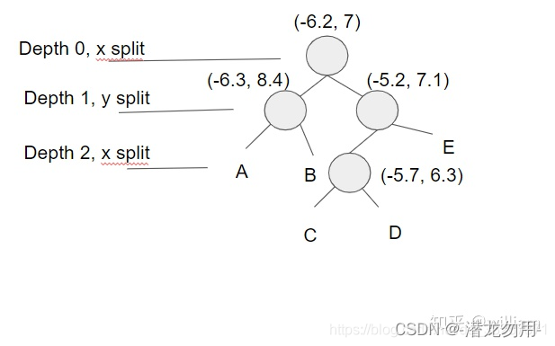
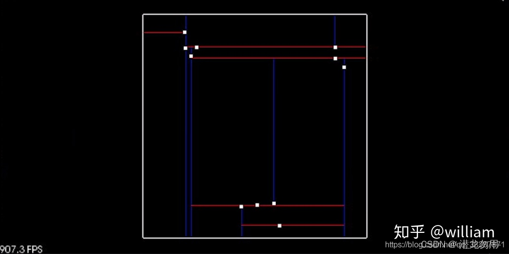
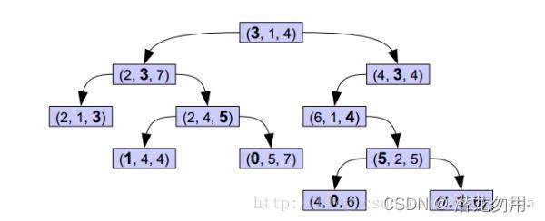
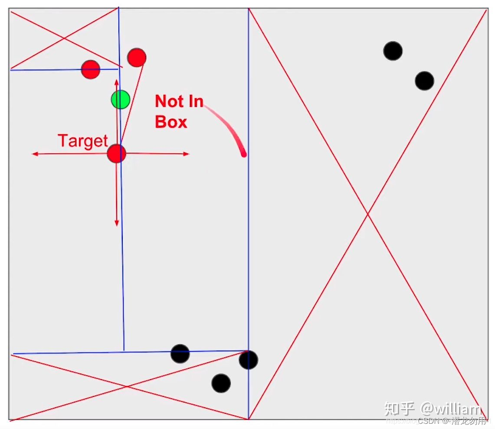

## KD-Tree

在此我们首先对KD-Tree的原理进行介绍. KD-Tree是一个数据结构, 由二进制树表示, 在不同维度之间对插入的点的数值进行交替比较, 通过分割区域来分割空间, 如在3D数据中, 需要交替在X,Y,Z不同轴上比较. 这样会使最近邻搜索可以快得多.


### 二维空间 KD-Tree

> 首先我们在试着二维空间上建立KD-Tree, 并讲述欧氏聚类的整个在二维空间上的实现过程, 最终我们将扩展到三维空间.

在KD-Tree中插入点(这是将点云输入到树中创建和构建KD-Tree的步骤)
假设我们需要在KD-Tree中插入４个点(-6.3, 8.4), (-6.2, 7), (-5.2, 7.1), (-5.7, 6.3)
首先我们得确定一个根点(-6.2, 7), 第0层为x轴, 需要插入的点为(-6.3, 8.4), (-5.2, 7.1), 因为-6.3<-6.2,(-6.3, 8.4)划分为左子节点, 而-5.2>-6.2, (-5.2, 7.1)划分为右子节点. (-5.7, 6.3)中x轴-5.7>-6.2,所以放在(-5.2, 7.1)节点下, 接下来第1层使用y轴, 6.3<7.1, 因此放在(-5.2, 7.1)的左子节点. 同理, 如果我们想插入第五个点(7.2, 6.1), 你可以交替对比x,y轴数值, (7.2>-6.2)->(6.1<7.1)->(7.2>-5.7), 第五点应插入到(-5.7, 6.3)的右子节点C.
下图是KD-Tree的结构.




KD-Tree的目的是将空间分成不同的区域, 从而减少最紧邻搜索的时间.Kd-Tree是从BST(Binary search tree)发展而来，是一种高维索引树形数据结构，常用于大规模高维数据密集的查找比对的使用场景中，主要是最近邻查找(Nearest Neighbor)以及近似最近邻查找(Approximate Nearest Neighbor)。在计算机视觉(CV)中主要是图像检索和识别中的高维特征向量的查找和比对。


在介绍Kd-Tree之前，首先介绍下它的父系结构——BST。二叉查找树，是一种具有如下性质的二叉树：

- 1.若它的左子树不为空，则它的左子树节点上的值皆小于它的根节点。
- 2.若它的右子树不为空，则它的右子树节点上的值皆大于它的根节点。
- 3.它的左右子树也分别是二叉查找树。



它是通过递归的方式使用新插入点更新节点. 其基本思想是遍历树, 直到它到达的节点为 NULL, 在这种情况下, 将创建一个新节点并替换 NULL 节点. 我们可以使用一个双指针来分配一个节点, 也就是说可以从根开始传递一个指向节点的指针, 然后当你想要替换一个节点时, 您可以解引用双指针并将其分配给新创建的节点.

- 1.在现有的数据中选定一个数据作为根节点的存储数值。（要求尽可能保证左右子树的集合的数量相等，优化查找速度）
- 2.将其它数据按照左小右大的规则往深层递归，直到叶节点，然后开辟新的叶节点，并存储当前值。
- 3.新的数据按照上一条进行存储。

以下就是一种二叉查找树结构示例：


上面聚类算法中，用到了数据结构kd-tree，采用kd-tree主要是为了加快数据的搜索查找速度。关于kd-tree的基础原理讲解见这里。这里主要通过c++代码来直观的理解kd-tree如何实现二维数据的插入、搜索。

如果是一维数据，我们可以用二叉查找树来进行存储，但是如果是多维的数据，用传统的二叉查找树就不能够满足我们的要求了，因此后来才发展出了满足多维数据的Kd-Tree数据结构。
Kd-tree的构造是在BST的基础上升级：

- 1.选定数据X1的Y1维数值a1做为根节点比对值，对所有的数值在Y1维进行一层BST排列。相当于根据Y1维数值a1对数据集进行分割。
- 2.选定数据X2的Y2维数值a2做为根节点比对值，对所有的数值在Y2维进行一层BST排列。也即将数据集在Y2维上又做了一层BST。

下图是一个简单的示例：



那么问题是：

1.如何决定每次根据哪个维度对子空间进行划分呢？
	直观的来看，我们一般会选择轮流来。先根据第一维，然后是第二维，然后第三……，那么到底轮流来行不行呢，这就要回到最开始我们为什么要研究选择哪一维进行划分的问题。我们研究Kd-Tree是为了优化在一堆数据中高频查找的速度，用树的形式，也是为了尽快的缩小检索范围，所以这个“比对维”就很关键，通常来说，更为分散的维度，我们就更容易的将其分开，是以这里我们通过求方差，用方差最大的维度来进行划分——这也就是最大方差法（max invarince）。


2.如何选定根节点的比对数值呢？
	选择何值未比对值，目的也是为了要加快检索速度。一般来说我们在构造一个二叉树的时候，当然是希望它是一棵尽量平衡的树，即左右子树中的结点个数相差不大。所以这里用当前维度的中值是比较合理的。


Kd-Tree和BST的区别：
BST的每个节点存储的是值，而Kd-Tree的根节点和中间节点存储的是对某个维度的划分信息，只有叶节点里才是存储的值。


### 二维空间 KD-Tree 代码


```cpp
struct Node {
    std::vector<float> point;
    int id;
    Node *left;
    Node *right;

    Node(std::vector<float> arr, int setId)
            : point(arr), id(setId), left(NULL), right(NULL) {}
};

struct KdTree {
    Node *root;

    KdTree()
            : root(NULL) {}
// Kd-Tree insert
    void insertHelper(Node **node, uint depth, std::vector<float> point, int id) {
        // Tree is empty
        if (*node == NULL) {
            *node = new Node(point, id);
        } else {
            // calculate current dim (1 means x axes, 2means y axes)
            uint cd = depth % 2;
            if (point[cd] < ((*node)->point[cd])) {
                insertHelper(&((*node)->left), depth + 1, point, id);
            } else {
                insertHelper(&((*node)->right), depth + 1, point, id);
            }
        }
    }

    void insert(std::vector<float> point, int id) {
        // TODO: Fill in this function to insert a new point into the tree
        // the function should create a new node and place correctly with in the root
        insertHelper(&root, 0, point, id);
    }
// #############################################################################################################

// Kd-Tree search
    void searchHelper(std::vector<float> target, Node *node, int depth, float distanceTol, std::vector<int> &ids)
    {
        if (node != NULL)
        {
            // Check whether the node inside box  or not, point[0] means x axes,　point[1]means y axes
            if ((node->point[0] >= (target[0] - distanceTol) && node->point[0] <= (target[0] + distanceTol)) &&(node->point[1] >= (target[1] - distanceTol) && node->point[1] <= (target[1] + distanceTol)))
            {
                float distance = sqrt((node->point[0] - target[0]) * (node->point[0] - target[0]) +(node->point[1] - target[1]) * (node->point[1] - target[1]));
                if (distance <= distanceTol)
                {
                    ids.push_back(node->id);
                }
            }
            // check across boundary
            if ((target[depth % 2] - distanceTol) < node->point[depth % 2])
            {
                searchHelper(target, node->left, depth + 1, distanceTol, ids);
            }
            if ((target[depth % 2] + distanceTol) > node->point[depth % 2])
            {
                searchHelper(target, node->right, depth + 1, distanceTol, ids);
            }

        }
    }

    // return a list of point ids in the tree that are within distance of target
    std::vector<int> search(std::vector<float> target, float distanceTol)
    {
        std::vector<int> ids;
        searchHelper(target, root, 0, distanceTol, ids);
        return ids;
    }

};

```

使用KD-Tree分割好的空间进行搜索



Kd-Tree分割区域并允许某些区域被完全排除, 从而加快了寻找近临点的进程
在上图中我们有8个点, 常规的方法是遍历计算每一个点到根点的距离, 在距离容忍度内的点为近邻点. 现在我们已经在Kd-Tree中插入了所有点, 我们建立一个根点周围２ x distanceTol长度的方框, 如果当前节点位于此框中, 则可以直接计算距离, 并查看是否应该将点 id 添加到紧邻点id 列表中, 然后通过查看方框是否跨越节点分割区域, 确定是否需要比较下一个节点. 递归地执行此操作, 其优点是如果框区域不在某个分割区域内, 则完全跳过该区域. 如上如图所示, 左上, 左下和右边分割区域均不在方框区域内, 直接跳过这些区域, 只需要计算方框内的绿点到根点的距离.


上面的代码块中第二部分为基于Kd-Tree的搜索代码.
一旦实现了用于搜索邻近点的Kd-Tree 方法, 就不难实现基于邻近度对单个聚类指标进行分组的欧氏聚类方法.
执行欧氏聚类需要迭代遍历云中的每个点, 并跟踪已经处理过的点. 对于每个点, 将其添加到一个集群(cluster)的点列表中, 然后使用前面的搜索函数获得该点附近所有点的列表. 对于距离很近但尚未处理的每个点, 将其添加到集群中, 并重复调用proximity的过程. 对于第一个集群, 递归停止后, 创建一个新的集群并移动点列表, 对于新的集群重复上面的过程. 一旦处理完所有的点, 就会找到一定数量的集群, 返回一个集群列表.


欧氏聚类:
