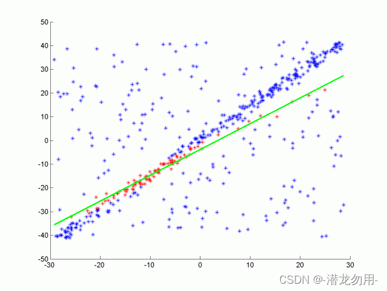
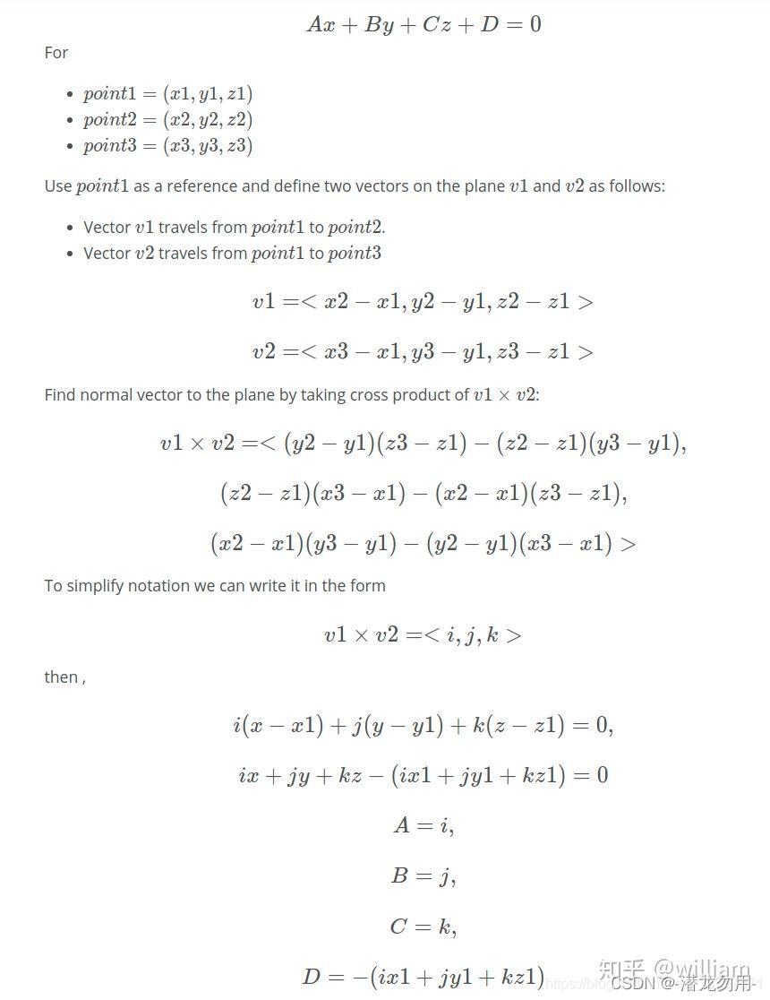

## **PCL RANSAC Segmentaion**

#### RANSAC全称Random Sample Consensus

目前粒子分割主要使用RANSAC算法. RANSAC全称Random Sample Consensus, 即随机样本一致性, 是一种检测数据中异常值的方法.

RANSAC通过多次迭代, 返回最佳的模型. 每次迭代随机选取数据的一个子集, 并生成一个模型拟合这个子样本, 例如一条直线或一个平面. 然后具有最多inliers(内联点)或最低噪声的拟合模型被作为最佳模型. 如其中一种RANSAC 算法使用数据的最小可能子集作为拟合对象. 对于直线来说是两点, 对于平面来说是三点. 然后通过迭代每个剩余点并计算其到模型的距离来计算 inliers 的个数. 与模型在一定距离内的点被计算为inliers. 具有最高 inliers 数的迭代模型就是最佳模型. 

这是我们在这个项目中的实现版本. 也就是说RANSAC算法通过不断迭代, 找到拟合最多inliers的模型, 而outliers被排除在外. RANSAC 的另一种方法对模型点的某个百分比进行采样, 例如20% 的总点, 然后将其拟合成一条直线. 然后计算该直线的误差, 以误差最小的迭代法为最佳模型. 这种方法的优点在于不需要考虑每次迭代每一点. 以下是使用RANSAC算法拟合一条直线的示意图, 真实激光数据下是对一个平面进行拟合, 从而分离物体和路面. 以下将单独对RANSAC平面算法进行实现.



#### RANSAC的平面计算公式



#### RANSAC的主体代码

```cpp
template<typename PointT>
std::unordered_set<int> Ransac<PointT>::Ransac3d(PtCdtr<PointT> cloud) {
    std::unordered_set<int> inliersResult; // unordered_set element has been unique
    // For max iterations
    while (maxIterations--) {
        std::unordered_set<int> inliers;
        while (inliers.size() < 3) {
            inliers.insert(rand()%num_points);
        }
        // TO define plane, need 3 points
        float x1, y1, z1, x2, y2, z2, x3, y3, z3;
        auto itr = inliers.begin();
        x1 = cloud->points[*itr].x; 　
        y1 = cloud->points[*itr].y;
        z1 = cloud->points[*itr].z; 　
        itr++;
        x2 = cloud->points[*itr].x;
        y2 = cloud->points[*itr].y;
        z2 = cloud->points[*itr].z;
        itr++;
        x3 = cloud->points[*itr].x;
        y3 = cloud->points[*itr].y;
        z3 = cloud->points[*itr].z;
        // Calulate plane coefficient
        float a, b, c, d, sqrt_abc;
        a = (y2 - y1) * (z3 - z1) - (z2 - z1) * (y3 - y1);
        b = (z2 - z1) * (x3 - x1) - (x2 - x1) * (z3 - z1);
        c = (x2 - x1) * (y3 - y1) - (y2 - y1) * (x3 - x1);
        d = -(a * x1 + b * y1 + c * z1);
        sqrt_abc = sqrt(a * a + b * b + c * c);
        // Check distance from point to plane
        for (int ind = 0; ind < num_points; ind++) {
            if (inliers.count(ind) > 0) { // that means: if the inlier in already exist, we dont need do anymore
                continue;
            }
            PointT point = cloud->points[ind];
            float x = point.x;
            float y = point.y;
            float z = point.z;
            float dist = fabs(a * x + b * y + c * z + d) / sqrt_abc; // calculate the distance between other points and plane

            if (dist < distanceTol) {
                inliers.insert(ind);
            }
            if (inliers.size() > inliersResult.size()) {
                inliersResult = inliers;

            }
        }
    }
    return inliersResult;
}

```

在实际中PCL已经内置了RANSAC函数, 而且比我写的计算速度更快, 所以直接用内置的就行了.
