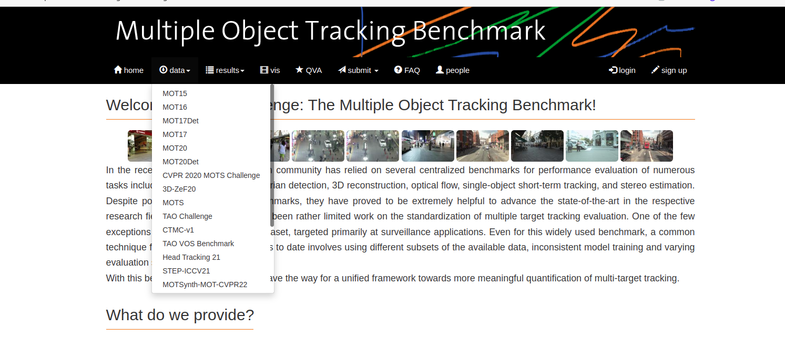

## Multi Object Tracking(MOT) 多目标追踪

> 04/25/2023 21:30 研究学习Multi Object Tracking(MOT)算法，仅用于个人学习，不用于商业使用。

[toc]

### 前言

#### 评价指标

HOTA metrics
paper：pdf

HOTA（高阶跟踪精度）是一种用于评估多目标跟踪 (MOT) 性能的新指标。它旨在克服先前指标（如 MOTA、IDF1 和 Track mAP）的许多限制。

HOTA 被视为组合3个欠条得分。它将评估跟踪的任务分为三个子任务（检测、关联和定位），并使用 IoU（交集对联合）公式（也称为 Jaccard 指数）计算每个子任务的分数。然后它将每个子任务的这三个 IoU 分数组合成最终的 HOTA 分数。
下面我们来看看这三个子任务的 IoU 分数是如何计算的。
具体详见：CSDN

MOTA metrics
paper：pdf

MOTA和MOTP共同衡量算法连续跟踪目标的能力（即，在连续帧中能准确判断目标的个数，精确的划定其位置，从而实现不间断的连续跟踪）。

MOTA（multiple object tracking accuracy）多目标跟踪的准确度，体现在确定目标的个数，以及有关目标的相关属性方面的准确度，用于统计在跟踪中的误差积累情况，包括FP、FN、ID Sw。

具体详见：知乎 与 CSDN

Identity metrics
paper：pdf

IDP：识别精确度 (Identification Precision) 是指每个行人框中行人 ID 识别的精确度。
IDR：识别回召率 (Identification Recall) 是指每个行人框中行人 ID 识别的回召率。
IDF1：识别 F 值 (Identification F-Score) 是指每个行人框中行人 ID 识别的 F 值。

---

经过不断完善，目前形成了一组多目标跟踪专用评估指标[63-64]。具体定义及计算公式如下：

1）FP：False Positive，即真实情况中没有，但跟踪算法误检出有目标存在。

2）FN：False Negative，即真实情况中有，但跟踪算法漏检了。

3）IDS：ID Switch，目标ID切换的次数。

4）MOTA: Multiple Object Tracking Accuracy，多目标跟踪准确度。

MOTA可以较好地反映跟踪准确度，是当前MOT的主要评估指标。但MOTA不能反映MOT算法对同一个目标轨迹长时间跟踪性能表现。

5）IDF1: ID F1得分，正确身份标签赋予的检测框与平均ground truth和计算的检测数量的比值。

6）MT：Mostly Tracked，大多数目标被跟踪的轨迹数量。目标被成功跟踪到的轨迹长度与轨迹总长度的比值大于等于80%的轨迹数量。

7）ML：Mostly Lost，大多数目标被跟丢的轨迹数量。目标被成功跟踪到的轨迹长度与轨迹总长度的比值小于等于20%的轨迹数量。

8）MOTP：Multiple Object Tracking Precision，多目标跟踪精度。表示得到的检测框和真实标注框之间的重合程度。

9）FPS：Frames Per Second，每秒处理的帧数。

#### 数据集

##### **MOTChallenge数据集**

地址: https://motchallenge.net/

MOTChallenge是目前MOT领域使用最多的数据集，主要是针对行人多目标跟踪任务，包括MOT15、MOT16、MOT17和MOT20等数据集。

##### **KITTI数据集**

KITTI数据集是目前全球最大的自动驾驶场景数据集，支持双目、光流、视觉测距、3D目标检测和3D跟踪等任务。通过一辆装有彩色/灰色立体摄像头、Velodyne HDL-64E旋转式3D激光扫描仪和GPS/IMU导航系统等多传感器的汽车在城市中环、郊区和高速公路等多个场景的多个路段收集而成。

对于MOT任务，KITTI提供了激光雷达点云和3D包围框轨迹。

##### **其它数据集**

除了MOTChallenge和KITTI数据集之外，还有几个较老的数据集，目前已经很少使用。主要有UA-DETRAC[60]数据集、TUD[61]数据集和PETS2009[62]数据集。感兴趣的朋友可以去网上搜一下。

### 相关研究

这些是我所了解的 **多目标跟踪** （MOT）的一些相关方向。其中 **单目标跟踪** （VOT/SOT）、 **目标检测** （detection）、 **行人重识别** （Re-ID）都是非常热门的方向。而偏视频的相关方向就比较冷门。而且今年五月DukeMTMC因为隐私问题不再提供MTMCT的数据了，MTMCT的研究也是举步维艰。

### 工作流程

MOT算法的通常工作流程：

- (1)给定视频的原始帧；
- (2)运行对象**检测器**以获得对象的边界框；
- (3)对于每个检测到的物体， **计算出不同的特征** ，通常是视觉和运动特征；
- (4)之后，**相似度计算步骤**计算两个对象属于同一目标的概率；
- (5)最后，**关联步骤**为每个对象分配数字ID。

因此绝大多数MOT算法无外乎就这四个步骤： **①检测 ②特征提取、运动预测 ③相似度计算 ④数据关联** 。

其中影响最大的部分在于检测，检测结果的好坏对于最后指标的影响是最大的。

但是，多目标追踪的研究重点又在**相似度计算**和**数据关联**这一块。所以就有一个很大的问题：你设计出更好的关联算法可能就提升了0.1个点，但别人用一些针对数据集的trick消除了一些漏检可能就能涨好几个点。所以研究更好的数据关联的回报收益很低。因此多目标追踪这一领域虽然工业界很有用，但学术界里因为指标数据集的一些原因，入坑前一定要 **三思** 。

### 研究方案

视觉目标跟踪的发展相对较短，主要集中在近十余年。早期比较经典的方法有Meanshift和粒子滤波等方法，但整体精度较低，且主要为单目标跟踪。

近五六年来，随着目标检测的性能得到了飞跃式进步，也诞生了**基于检测进行跟踪**的方案，并迅速成为当前多目标跟踪的主流框架，极大地推动了MOT任务的前进。同时，近期也出现了**基于检测和跟踪联合框架**以及 **基于注意力机制的框架** ，开始引起研究者们的注意力。

##### **1, 基于Tracking-by-detection的MOT**

**Tracking-by-Detecton** 基于目标检测的结果来进行目标跟踪：

- 匈牙利算法（KM算法）：将前一帧中的跟踪框tracks与当前帧中的检测框detections进行关联，通过外观信息、马氏距离、或者IOU来计算代价矩
- 卡尔曼滤波：基于传感器的测量值（在目标跟踪中即目标检测器）与跟踪器的预测值，实现更精确的估计。（结合预测（先验分布）和测量更新（似然）的状态估计算法）

基于Tracking-by-detaction框架的MOT算法是先对视频序列的每一帧进行目标检测，根据包围框对目标进行裁剪，得到图像中的所有目标。然后，转化为前后两帧之间的目标关联问题，通过IoU、外观等构建相似度矩阵，并通过匈牙利算法、贪婪算法等方法进行求解。

**代表方法: SORT, DeepSORT, StrongSORT, OC- SORT, Deep OC-SORT, ByteTrack, Bot-SORT**

#### **2, 基于检测和跟踪联合的MOT**

JDE采用FPN结构，分别从原图的 1/8，1/16 和 1/32 三个尺度进行预测。在这三个不同尺度的输出特征图上分别加入预测头(prediction head)，每个预测头由几层卷积层构成，并输出大小为 (6A+D)×H×W 的特征向量。其中 A 为对应尺度下设置的锚框的数量，D 是外观特征的维度。

JDE在MOT16测试集上MOTA=64.4%，GPU环境下，高分辨率输入图像下FPS达到22.2，低分辨率输入图像下FPS达到30.3，是第一个接近实时的多目标跟踪算法。

**代表方法：JDE、FairMOT、CenterTrack、ChainedTracker等**

#### **3, 基于注意力机制的MOT**

随着Transformer[42]等注意力机制在计算机视觉中的应用火热，近期开始有研究者提出了基于注意力机制的多目标跟踪框架，目前主要有TransTrack[43]和TrackFormer[44]，这两项工作都是将Transformer应用到MOT中。

TransTrack将当前帧的特征图作为Key，将前一帧的目标特征Query和一组从当前帧学习到的目标特征Query一起作为整个网络的输入Query。

**代表方法：TransTrack、TrackFormer, DanceTrack, MOTR, MOTRv2 等**

### Tracking-by-detection

#### KF算法

##### 算法简介

**卡尔曼滤波**分为两个过程：**预测**和 **更新** 。预测过程：当一个小车经过移动后，且其初始定位和移动过程都是高斯分布时，则最终估计位置分布会更分散，即更不准确；更新过程：当一个小车经过传感器观测定位，且其初始定位和观测都是高斯分布时，则观测后的位置分布会更集中，即更准确。

#### HA算法

##### 算法简介

**匈牙利算法**解决的是一个 **分配问题** 。SK-learn库的linear_assignment *_* 和scipy库的linear_sum_assignment都实现了这一算法，只需要输入cost_matrix即**代价矩阵**就能得到最优匹配。不过要注意的是这两个库函数虽然算法一样,但给的输出格式不同。具体算法步骤也很简单，是一个复杂度 O(n3) 的算法。

匈牙利算法（Hungarian Algorithm）与KM算法（Kuhn-Munkres Algorithm）是做多目标跟踪的小伙伴很容易在论文中见到的两种算法。他们都是用来解决多目标跟踪中的**数据关联**问题。

对理论没有兴趣的小伙伴可以先跳过本文，进行下一篇的学习，把匈牙利算法这些先当作一个黑箱来用，等需要了再回过头来学习理论。**但个人建议，至少要明白这些算法的目的与大致流程。**

如果大家用这两种算法的名字在搜索引擎上搜索，一定会首先看到这个名词： **二分图** （二部图）。匈牙利算法与KM算法都是为了求解 **二分图的最大匹配问题** 。

有一种很特别的图，就做二分图，那什么是二分图呢？就是能分成两组，U,V。其中，U上的点不能相互连通，只能连去V中的点，同理，V中的点不能相互连通，只能连去U中的点。这样，就叫做二分图。

读者可以把二分图理解为视频中连续两帧中的所有检测框，第一帧所有检测框的集合称为U，第二帧所有检测框的集合称为V。同一帧的不同检测框不会为同一个目标，所以不需要互相关联，相邻两帧的检测框需要相互联通，最终将相邻两帧的检测框尽量完美地两两匹配起来。而求解这个问题的最优解就要用到匈牙利算法或者KM算法。

先介绍匈牙利算法，引用百度百科的说法，**匈牙利算法**是一种在[多项式时间](https://link.zhihu.com/?target=https%3A//baike.baidu.com/item/%25E5%25A4%259A%25E9%25A1%25B9%25E5%25BC%258F%25E6%2597%25B6%25E9%2597%25B4)内求解任务分配问题的[组合优化](https://link.zhihu.com/?target=https%3A//baike.baidu.com/item/%25E7%25BB%2584%25E5%2590%2588%25E4%25BC%2598%25E5%258C%2596)[算法](https://link.zhihu.com/?target=https%3A//baike.baidu.com/item/%25E7%25AE%2597%25E6%25B3%2595)，并推动了后来的原始对偶方法。美国数学家哈罗德·库恩于1955年提出该算法。此算法之所以被称作匈牙利算法，是因为算法很大一部分是基于以前[匈牙利](https://link.zhihu.com/?target=https%3A//baike.baidu.com/item/%25E5%258C%2588%25E7%2589%2599%25E5%2588%25A9)数学家Dénes Kőnig和Jenő Egerváry的工作之上创建起来的。

> [https://**blog.csdn.net/dark_scop**e/article/details/8880547#commentBox](https://link.zhihu.com/?target=https%3A//blog.csdn.net/dark_scope/article/details/8880547%23commentBox)

这篇博文对匈牙利算法进行了非常简单清晰的解释，我这里引用它来说明一下匈牙利算法的流程。

以上图为例，假设左边的四张图是我们在第N帧检测到的目标（U），右边四张图是我们在第N+1帧检测到的目标（V）。红线连起来的图，是我们的算法认为是同一行人可能性较大的目标。由于算法并不是绝对理想的，因此并不一定会保证每张图都有一对一的匹配，一对二甚至一对多，再甚至多对多的情况都时有发生。这时我们怎么获得最终的一对一跟踪结果呢？我们来看匈牙利算法是怎么做的。

**第一步.**

首先给左1进行匹配，发现第一个与其相连的右1还未匹配，将其配对，连上一条蓝线。

**第二步.**

接着匹配左2，发现与其相连的第一个目标右2还未匹配，将其配对。

**第三步.**

接下来是左3，发现最优先的目标右1已经匹配完成了，怎么办呢？ 我们给之前右1的匹配对象左1分配另一个对象。（黄色表示这条边被临时拆掉）

可以与左1匹配的第二个目标是右2，但右2也已经有了匹配对象，怎么办呢？我们再给之前右2的匹配对象左2分配另一个对象（注意这个步骤和上面是一样的，这是一个递归的过程）。

此时发现左2还能匹配右3，那么之前的问题迎刃而解了，回溯回去。左2对右3，左1对右2，左3对右1。

所以第三步最后的结果就是：

**第四步.**

最后是左4，很遗憾，按照第三步的节奏我们没法给左4腾出来一个匹配对象，只能放弃对左4的匹配，匈牙利算法流程至此结束。蓝线就是我们最后的匹配结果。至此我们找到了这个二分图的一个最大匹配。

再次感谢[Dark_Scope](https://link.zhihu.com/?target=https%3A//blog.csdn.net/Dark_Scope)的分享，我这里只是把其中的例子替换成了多目标跟踪的实际场景便于大家理解。

最终的结果是我们匹配出了三对目标，由于候选的匹配目标中包含了许多 **错误的匹配红线（边）** ，所以匹配准确率并不高。可见匈牙利算法对红线连接的准确率要求很高，也就是要求我们运动模型、外观模型等部件必须进行较为精准的预测，或者预设较高的阈值， **只将置信度较高的边才送入匈牙利算法进行匹配** ，这样才能得到较好的结果。

匈牙利算法的流程大家看到了，有一个很明显的问题相信大家也发现了，按这个思路找到的最大匹配往往不是我们心中的最优。匈牙利算法将每个匹配对象的地位视为相同，在这个前提下求解最大匹配。这个和我们研究的多目标跟踪问题有些不合，因为每个匹配对象不可能是同等地位的，总有一个真实目标是我们要找的最佳匹配，而这个真实目标应该拥有更高的权重，在此基础上匹配的结果才能更贴近真实情况。

KM算法就能比较好地解决这个问题，我们下面来看看KM算法。

#### KM算法

##### 算法简介

KM算法（Kuhn-Munkres Algorithm）, KM算法解决的是**带权二分图的最优匹配**问题。

还是用上面的图来举例子，这次给每条连接关系加入了权重，也就是我们算法中其他模块给出的置信度分值。

KM算法解决问题的步骤是这样的。

**第一步**

首先对每个顶点赋值，称为 **顶标** ，将左边的顶点赋值为与其相连的边的 **最大权重** ，右边的顶点赋值为 **0** 。

**第二步，开始匹配**

匹配的原则是只和权重与左边分数（顶标）相同的边进行匹配，若找不到边匹配，对此条路径的所有左边顶点的顶标减d，所有右边顶点的顶标加d。参数d我们在这里取值为0.1。

对于左1，与顶标分值相同的边先标蓝。

然后是左2，与顶标分值相同的边标蓝。

然后是左3，发现与右1已经与左1配对。首先想到让左3更换匹配对象，然而根据匹配原则，只有权值大于等于0.9+0=0.9（左顶标加右顶标）的边能满足要求。于是左3无法换边。那左1能不能换边呢？对于左1来说，只有权值大于等于0.8+0=0.8的边能满足要求，无法换边。此时根据KM算法，应对所有冲突的边的顶点做加减操作，令左边顶点值减0.1，右边顶点值加0.1。结果如下图所示。

再进行匹配操作，发现左3多了一条可匹配的边，因为此时左3对右2的匹配要求只需权重大于等于0.8+0即可，所以左3与右2匹配！

最后进行左4的匹配，由于左4唯一的匹配对象右3已被左2匹配，发生冲突。进行一轮加减d操作，再匹配，左四还是匹配失败。两轮以后左4期望值降为0，放弃匹配左4。

至此KM算法流程结束，三对目标成功匹配，甚至在左三目标预测不够准确的情况下也进行了正确匹配。**可见在引入了权重之后，匹配成功率大大提高。**

这篇文章可能信息量有点大，读起来略费脑。不过笔者力求排除复杂的理论推导，使用形象的例子来说明这两种算法。至于具体的理论，有兴趣的读者可以再去搜寻，网上有很多资料，相信有了感性的理解后，对理论的掌握会更加容易。

最后还有一点值得注意， **匈牙利算法得到的最大匹配并不是唯一的** ，预设匹配边、或者匹配顺序不同等，都可能会导致有多种最大匹配情况，所以有一种替代KM算法的想法是，我们只需要用匈牙利算法找到所有的最大匹配，比较每个最大匹配的权重，再选出最大权重的最优匹配即可得到更贴近真实情况的匹配结果。但这种方法时间复杂度较高，会随着目标数越来越多，消耗的时间大大增加，实际使用中并不推荐。

复杂的理论终于结束了，下一篇将是大家喜闻乐见的网络环节，轻松易懂不费脑，感谢大家的关注！

码字仓促，文中若有错误，还请各位不吝指教。欢迎各位在评论区留言，大家互相交流学习。

#### SORT

Simple Online and Realtime Tracking

代码地址: https://github.com/abewley/sort

论文下载: https://arxiv.org/abs/1602.00763

##### 算法简介

首先要说明一点，现在多目标跟踪算法的效果，与目标检测的结果息息相关，因为主流的多目标跟踪算法都是TBD（Tracking-by-Detecton）策略，这里不再赘述，有不懂的小伙伴可以去看本系列的第一篇领域综述。

在SORT论文的一开始，作者也强调了这一点。作者原话是说通过更换检测器可以将跟踪效果提高18.9个百分点。说这点是为了给做工程的朋友们一个启示，用再花哨的跟踪算法，有时也不如用针对性训练的检测器来的效果好。在实际工程中，为了提高多目标跟踪的效果，可以从检测器处多做文章（比如多收集一些对应任务的数据来训练检测器），跟踪的效果也会水涨船高。

抛开检测不谈，我们来看SORT的跟踪思路。SORT采用的是在线跟踪的方式，不使用未来帧的信息。在保持100fps以上的帧率的同时，也获得了较高的MOTA（在当时16年的结果中）。

SORT的贡献主要有三：

* 利用强大的CNN检测器的检测结果来进行多目标跟踪
* 使用基于卡尔曼滤波（Kalman filter）与匈牙利算法（Hungarian algorithm）的方法来进行跟踪
* 开源了代码，为MOT领域提供一个新的baseline

现在看可能不觉得有什么，思路并不新奇也并不复杂，但在当时还是作出很大的贡献的，有力推动了MOT的发展。

其中 **卡尔曼滤波（Kalman filter** ）与 **匈牙利算法（Hungarian algorithm）** 对于大家来说可能是两个新名词。先简单解释一下， **匈牙利算法是一种寻找二分图的最大匹配的算法** ，在多目标跟踪问题中可以简单理解为寻找前后两帧的若干目标的匹配最优解的一种算法。而 **卡尔曼滤波可以看作是一种运动模型** ，用来对目标的轨迹进行预测，并且使用确信度较高的跟踪结果进行预测结果的修正，是控制领域常用的一种算法。有熟悉无人机飞控算法的小伙伴应该会对这个感到很亲切。

可能初次接触的小伙伴还不是非常理解，不用担心，我们存疑，后文还会更详细地讲到。

至于具体的跟踪过程，SORT在以往二阶段匹配算法的基础上进行了创新。

以往二阶段匹配算法是先使用匈牙利算法对相邻帧之间的目标进行匹配生成很多tracklets，之后使用这些tracklets进行二次匹配，以解决遮挡等问题引起的轨迹中断。但这种二阶段匹配方式弊端也很明显，因为这种方式先天地要求必须以Offline的方法进行跟踪，而无法做到Online。

SORT将这种二阶段匹配算法改进为了 **一阶段方法** ，并且可以 **在线跟踪** 。

具体而言，SORT引入了线性速度模型与卡尔曼滤波来进行 **位置预测** ，先进行位置预测然后再进行匹配。在无合适匹配检测框的情况下，运动模型的结果可以用来预测物体的位置。

在数据关联的阶段，SORT使用的依旧是匈牙利算法逐帧关联，不过作者还引入了 **IOU（Intersection-Over-Union）距离** 。不过SORT用的是带权重的匈牙利算法，其实就是KM算法，用IOU距离作为权重（也叫cost矩阵）。作者代码里是直接用sklearn的linear_assignment实现，有兴趣的话也可以去看看这个函数的实现细节，我下一篇文章会稍微讲讲匈牙利算法和KM算法的原理，这里不懂可以先存疑。并且当IOU小于一定数值时，不认为是同一个目标，理论基础是视频中两帧之间物体移动不会过多。作者在代码中选取的阈值是0.3，

不过我个人在实验中对这一点不是完全认同，虽然两帧之间物体的运动量可能不大，但由于检测器自身检测结果不准，目标框偏移可能较大，还是会造成IOU过小，这时再用论文中这种方法，会导致误判引起的轨迹中断。具体案例在MOT的DPM检测结果中很容易找到。说起 **DPM** ，真可谓是MOT研究者的梦魇了……衷心希望MOT19能抛弃DPM。

##### 算法框架

这个SORT的流程图非常重要，可以看到整体可以拆分为两个部分，分别是**匹配过程**和 **卡尔曼预测加更新过程** ，都用灰色框标出来了。一定要把整个流程弄明白。后面的多目标追踪的大框架基本都由此而来。

关键步骤：轨迹卡尔曼滤波 **预测** → 使用**匈牙利算法**将预测后的tracks和当前帧中的detecions进行匹配（ **IOU匹配** ） → 卡尔曼滤波**更新**

对于没有匹配上的轨迹，也不是马上就删掉了，有个T_lost的保存时间，但SORT里把这个时间阈值设置的是1，也就是说对于没匹配上的轨迹相当于直接删了。

#### DeepSORT

Simple Online and Realtime Tracking with a Deep Association Metric

论文下载: https://arxiv.org/abs/1703.07402

代码地址: https://github.com/nwojke/deep_sort

##### 算法简介

一年之后，原团队发布了SORT的续作DeepSORT，到现在都有很多人在用这个跟踪器。

这是DeepSORT算法的流程图，和SORT基本一样，就多了 **级联匹配** （Matching Cascade）和 **新轨迹的确认** （confirmed）

关键步骤：轨迹卡尔曼滤波 **预测** → 使用**匈牙利算法**将预测后的tracks和当前帧中的detecions进行匹配（**级联匹配**和 **IOU匹配** ） → 卡尔曼滤波**更新**

**级联匹配**是核心，就是红色部分，DeepSORT的绝大多数创新点都在这里面，具体过程看下一张图。

关于为什么新轨迹要连续三帧命中才确认？个人认为有这样严格的条件和测试集有关系。因为测试集给的检测输入非常的差，误检有很多，因此轨迹的产生必须要更严格的条件。

级联匹配流程图里上半部分就是**特征提取**和 **相似度估计** ，也就是算这个分配问题的代价函数。主要由两部分组成：代表运动模型的**马氏距离**和代表外观模型的 **Re-ID特征** 。

级联匹配流程图里下半部分**数据关联**作为流程的主体。为什么叫级联匹配，主要是它的匹配过程是一个 **循环** 。从missing age=0的轨迹（即每一帧都匹配上，没有丢失过的）到missing age=30的轨迹（即丢失轨迹的最大时间30帧）挨个的和检测结果进行 **匹配** 。也就是说，对于没有丢失过的轨迹赋予**优先匹配**的权利，而丢失的最久的轨迹最后匹配。

论文关于参数λ（运动模型的代价占比）的取值是这么说的：

> 在我们的实验中，我们发现当相机运动明显时，将λ= 0设置是一个合理的选择。

因为相机抖动明显，卡尔曼预测所基于的匀速运动模型并不work，所以马氏距离其实并没有什么作用。但注意也不是完全没用了，主要是通过阈值矩阵（Gate Matrix）对代价矩阵（Cost Matrix）做了一次 **阈值限制** 。

关于DeepSORT算法的详细代码解读我比较推荐：[目标跟踪初探（DeepSORT）](https://zhuanlan.zhihu.com/p/90835266)

但关于卡尔曼滤波的公式讲的不是很详细，具体推导可以看看 [Kalman Filter 卡尔曼滤波](https://link.zhihu.com/?target=http%3A//www.harlek.cn/2019/12/02/qia-er-man-lu-bo/)

看到这个DeepSORT的流程图不知道大家可以想到什么**优化**的地方？其实有几个点是很容易想到的。

第一点，把 **Re-ID网络和检测网络融合** ，做一个精度和速度的trade off；

第二点，对于轨迹段来说，时间越长的轨迹是不是更应该得到更多的信任，不仅仅只是级联匹配的优先级，由此可以引入 **轨迹评分的机制** ；

第三点，从直觉上来说，检测和追踪是两个相辅相成的问题，良好的追踪可以弥补检测的漏检，良好的检测可以防止追踪的轨道飘逸，**用预测来弥补漏检**这个问题在DeepSORT里也并没有考虑；

第四点，DeepSORT里给马氏距离也就是运动模型设置的系数为0，也就是说在相机运动的情况下线性速度模型并不work，所以是不是可以找到 **更好的运动模型** 。

---

DeepSORT的优化主要就是基于匈牙利算法里的这个 **代价矩阵** 。它在IOU Match之前做了一次额外的 **级联匹配** ，利用了**外观特征**和 **马氏距离** 。

**外观特征**就是通过一个Re-ID的网络提取的，而提取这个特征的过程和NLP里词向量的**嵌入**过程（embedding）很像，所以后面有的论文也把这个步骤叫做嵌入（起源应该不是NLP，但我第一次接触embedding是从NLP里）。然后是因为欧氏距离忽略空间域分布的计算结果，所以增加里**马氏距离**作为运动信息的约束。

整体框架没有大改，还是延续了卡尔曼滤波加匈牙利算法的思路，在这个基础上增加了 **Deep Association Metric** 。Deep Association Metric其实就是在大型行人重识别网络上学习的一个行人鉴别网络。目的是区分出不同的行人。个人感觉很类似于典型的行人重识别网络。输出行人图片，输出一组向量，通过比对两个向量之间的距离，来判断两副输入图片是否是同一个行人。

此外还加入了外观信息（ **Appearance Information** ）以实现较长时间遮挡的目标跟踪。

跟踪流程延续上作，在卡尔曼滤波的预测结果的基础上，继续使用了匈牙利算法进行目标分配，但在这个过程中加入了运动信息和外观信息。这个说起来简单，实现起来比较复杂，感兴趣的读者可以细看论文和代码。在这里就不赘述了。

其他方面没有太多变化，还是使用了标准的卡尔曼滤波和固定速度模型等来进行预测。

最终实现了较好的跟踪效果（MOTA61.4@MOT16），并且能够实时运行（40FPS）。

这一篇和大家一起过了一遍SORT这个经典的算法，虽然思路并不复杂，但还是值得细细品味的。当然其中还有几点概念没有说清，下一篇将带大家继续深入。

下一篇将着重讲解MOT中常用的一些算法，比如匈牙利算法和KM算法等。打下一个良好的基础，才能走的更远，朋友们下篇见！

希望大家有什么问题可以在下面评论，欢迎交流讨论。码字仓促，文中若有错误还请大家不吝指教，多多包涵。转载请联系作者并注明出处，侵权必究。

##### 算法框架

#### ByteTrack

论文地址：[ByteTrack: Multi-Object Tracking by Associating Every Detection Box](https://arxiv.org/pdf/2110.06864.pdf)
开源代码：[ByteTrack](https://github.com/ifzhang/ByteTrack)

##### 算法简介

ByteTrack 是基于 tracking-by-detection 范式的跟踪方法。作者提出了一种简单高效的数据关联方法 BYTE。它和之前跟踪算法的最大区别在于，并不是简单的去掉低分检测结果，正如论文标题所述，Assiciating Every Detection Box。利用检测框和跟踪轨迹之间的相似性，在保留高分检测结果的同时，从低分检测结果中去除背景，挖掘出真正的物体（遮挡、模糊等困难样本），从而降低漏检并提高轨迹的连贯性。速度到 30 FPS（单张 V100），各项指标均有突破。就我个人 demo 测试来看，相比 deep sort，ByteTrack 在遮挡情况下的提升非常明显。但是需要注意的是，由于ByteTrack 没有采用外表特征进行匹配，所以跟踪的效果非常依赖检测的效果，也就是说如果检测器的效果很好，跟踪也会取得不错的效果，但是如果检测的效果不好，那么会严重影响跟踪的效果。

ByteTrack 的核心在于 BYTE，也就是说可以套用任何你自己的检测算法，把你的检测结果输入跟踪器即可，和 deepsort 类似，这种方式相比 JDE 和 FairMOT，在工程应用上更为简洁。

##### 算法原理

###### 1. BYTE

前面提到作者保留了低分检测框，直接当做高分检测框处理显然是不合理的，那样会带来很多背景（false positive）。BYTE 数据关联方法具体的流程如下：

- 根据检测框得分，把检测框分为高分框和低分框，分开处理
- 第一次使用高分框和之前的跟踪轨迹进行匹配
- 第二次使用低分框和第一次没有匹配上高分框的跟踪轨迹（例如在当前帧受到严重遮挡导致得分下降的物体）进行匹配
- 对于没有匹配上跟踪轨迹，得分又足够高的检测框，我们对其新建一个跟踪轨迹。对于没有匹配上检测框的跟踪轨迹，我们会保留30帧，在其再次出现时再进行匹配

BYTE 的**工作原理**可以理解为，遮挡往往伴随着检测得分由高到低的缓慢降低：被遮挡物体在被遮挡之前是可视物体，检测分数较高，建立轨迹；当物体被遮挡时，通过检测框与轨迹的位置重合度就能把遮挡的物体从低分框中挖掘出来，保持轨迹的连贯性。

###### 2. ByteTrack

ByteTrack 的检测器部分采用 YOLOX。

在数据关键的部分，和 SORT 一样，只使用卡尔曼滤波来预测当前帧的跟踪轨迹在下一帧的位置，预测的框和实际的检测框之间的 IoU 作为两次匹配时的相似度，通过匈牙利算法完成匹配。这里值得注意的是 ByteTrack 没有使用 ReID 特征来计算外观相似度，也就是说仅仅使用了运动模型。

为什么没有使用ReID 特征？ 作者解释：第一点是为了尽可能做到简单高速，第二点是我们发现在检测结果足够好的情况下，卡尔曼滤波的预测准确性非常高，能够代替 ReID 进行物体间的长时刻关联。实验中也发现加入 ReID 对跟踪结果没有提升。

根据 ByteTrack 部分的代码整理跟踪算法的流程，如下所示。

#### StrongSORT

Make DeepSORT Great Again

论文地址: https://arxiv.org/pdf/2202.13514.pdf

代码地址: [https://github.com/dyhBUPT/StrongSORT]()

##### 背景概述

Strong SORT算法基于经典的Deep SORT模型，并从[目标检测模型](https://so.csdn.net/so/search?q=%E7%9B%AE%E6%A0%87%E6%A3%80%E6%B5%8B%E6%A8%A1%E5%9E%8B&spm=1001.2101.3001.7020)、表征特征模型和匹配算法等各个方面对其进行了升级优化。

##### 算法改进

###### 1. 表观特征分支的优化算法

对于Strong SORT算法的表观特征分支部分，主要是进行了2方面的优化，一是优化了特征提取器的能力，二是利用了EMA（Exponential moving average）特征更新策略从而取代Deep SORT算法中的特征库。

1. Strong SORT使用了更强大的表观特征提取器BoT来代替原来简单的CNN网络。以ResNeSt50作为主干并在DukeMTMC-reID数据集上进行预训练，该表观特征提取器可以提取更多的判别特征。
2. 此外，将特征库替换为EMA（Exponential moving average）特征更新策略。对于轨迹 `i`在第 `t`帧的表观特征如下：

EMA特征更新策略不仅仅增强了匹配的质量，同时也节省了匹配的时间，不再需要和特征库（通常是1条轨迹保留近100个特征向量组成）相匹配。

###### 2. 运动模型分支的优化算法

对于Strong SORT算法的运动模型分支部分，主要是进行了2方面的优化，一是采用ECC算法（Enhanced Correlation Coefficient）进行了摄像机运动补偿，二是使用了NSA卡尔曼算法取代了传统的卡尔曼算法。

ECC算法（Enhanced Correlation Coefficient）
ECC算法全名是增强相关系数算法，这个算法是适用于图像配准任务的。也就是对于两张内容差异小，但是存在光照、尺度、颜色、平移等变换影响的图像，将二者对齐。

NSA卡尔曼滤波算法

在Deep SORT中，基于线性运动假设的卡尔曼滤波器用于对物体运动进行建模。它由状态估计步骤和状态更新步骤组成。卡尔曼滤波器先产生当前状态变量的估计，以及它们的不确定性。然后用估计状态和测量值的加权平均值更新这些估计值。

##### StrongSORT代码详解

- 此文章是对mikel-brostrom代码仓的StrongSORT代码进行详解；
- 具体代码分析请参考StrongSORT（deepsort强化版）浅实战＋代码解析这篇博客，介绍的很清晰。
- 注意调用过程StrongSORT类–> Tracker类–>Track类–>KalmanFilter类

#### Bot-SORT

Robust Associations Multi-Pedestrian Tracking

论文地址: https://arxiv.org/pdf/2206.14651.pdf

##### 算法简介

最近新出的霸榜的[多目标跟踪](https://so.csdn.net/so/search?q=%E5%A4%9A%E7%9B%AE%E6%A0%87%E8%B7%9F%E8%B8%AA&spm=1001.2101.3001.7020)BoT-SORT论文在MOTChallenge数据集上得出的结果排名第一(state-of-the-art)，其中指标实现了 80.5% MOTA、80.2% IDF1 和 65.0% HOTA。

###### 一、修改卡尔曼滤波（KF）中的状态向量及其他矩阵参数

起初SORT中KF状态向量为7元组组成：, 其中x，y为中心值，s为边界框比例(面积)，a为边界框的纵横比(w/h)。

而DeepSort中KF状态向量改为8元组：，a依然为边界框的纵横比，只是将第四维改成的边界框的高度h预测。

论文中修改KF状态向量为如下形式：，将宽高比改成了预测宽度w，是因为作者发现在真实预测的过程中预测框总是不将行人完全包括进去，而正确的预测宽高能更好的匹配行人框，对跟踪匹配中的IOU也有很大的改善。

另外根据状态向量修改初始化的矩阵参数（过程噪声、测量噪声）以满足总体修改预测。

###### 二、相机运动补偿（Camera Motion Compensation）

由于KF是匀速线性运动模型，对于跟踪非线性来说会产生不适配的问题，作者提出使用传统的方法 **Global motion compensation (GMC)** ，使用OpenCV中的提取图像关键点技术对背景提取特征描述子（类似ORG、SIFT、SURF），并且通过特征点进行稀疏光流跟踪来使用RANSAC计算并获取背景运动的仿射变换矩阵，以此通过前后帧的运动信息生成仿射变换矩阵来预测行人边界框，称为运动补偿，仿射变换矩阵平移部分只会影响中心点位置，而其它的影响状态向量和噪声矩阵。由此作者给出了运动校正的等式方程：

对于在跟踪中加入运动补偿后的效果其实是可想而知的，作者实验也贴了图，实际过程中，KF在预测的时候，假如目标运动过快或者过慢的情况可能会出现预测的滞后与提前，而在运动匹配的过程中iou匹配其实会显得比较困难，因为不管预测框是滞后或提前总是会造成与检测框的重合度不高的情况，这就给MOT带来了极大的挑战，况且不说运动模糊的情况。

###### 三、IOU+ReID的融合机制

使用FastReID库中ResNest50作为backbone，BoT(SBS)作为基线训练reid网络，网络训练使用默认的参数，从FastReID项目中可以找到，使用的分辨率为128x384的输入分辨率，损失函数使用了经典的TripletLoss，总共迭代60个epoch训练出强有力的ReID网络提取特征。并且采用指数移动平均(EMA)来更新第k帧中第i个预测框的轨迹状态，在拥挤以及遮挡的场景中检测得分低的表示特征不可靠，并不会用来做特征匹配。

并且有提出使用IOU+ReID融合机制的策略来进行匹配，使用下面公式作为匹配输出：

作者使用设置iou阈值为0.5，余弦相似度阈值为0.2作为匹配的限制。

作者最后提到可能对于使用场景的不同，对于GMC来说大图会产生耗时较大的问题，可以采用多线程的方式来抵消平衡这一部分耗时，不过博主觉得在嵌入式端的话使用的分辨率一般不会太大，毕竟板端的耗时太大会影响整个跟踪的性能。

另外作者也使用到了一些匹配小技巧，在跟踪中经常发生，由于目标的遮挡以及未匹配会导致预测的梯度弥散效应，导致预测框的形变发生，而这里可以做一些基础的策略来保持，作者未提出只是给了相关文献，大概能知道为了保持此预测框在目标出现是尽可能的匹配上连接之前的轨迹，类似ByteTrack策略，在低得分的检测框出现的时候依然使用IOU去做匹配，以保持轨迹的连续性。

而且作者说自己其实也不清楚是为什么使得MOT的一些指标有提升的，猜想可能是因为KF的状态向量W参数的预测修改使得预测框与检测框拟合，匹配更好导致的。这一点我觉得还是很有用的，对于预测框大小的拟合能做到与检测框类似相差不大的情况下，iou匹配是可以起到很鲁棒的作用。

实用性：
个人认为这篇论文还是有很多实用参考价值的，因为其中的运动过程中丢失目标是跟踪过程中时常发生的，对于KF中的状态修改可以直接影响预测的匹配，对于运动补偿对于实践可能会稍微困难点，但值得一试！！！

### 基于检测和跟踪联合的MOT

#### JDE

这是刚才第二篇论文（JDE）里的结构图。这个方法是基于YOLOv3和MOTDT做的。它网络前面都和YOLOv3一样的，主要就是在特征图里多提取了一个嵌入（embedding）向量，采取的是 **类似于交叉熵的triplet loss** 。因为是多任务学习，这篇论文还用了一篇18年的论文提出来的 **自动学习损失权重方案** ：通过学习一组辅助参数自动地对非均匀损失进行加权。最后的结果是精度上差不太多，FPS高了很多。

### 参考资源:

- [多目标跟踪(MOT)最新综述，一文快速入门](https://zhuanlan.zhihu.com/p/388721763?utm_id=0)
- [带你入门多目标跟踪（二）SORT&amp;DeepSORT](https://zhuanlan.zhihu.com/p/62858357)
- [带你入门多目标跟踪（三）匈牙利算法&amp;&amp;KM算法](https://zhuanlan.zhihu.com/p/62981901)
- [目标跟踪算法: Strong SORT多目标跟踪模型论文解析+代码详解](https://blog.csdn.net/qq_43348528/article/details/129619337?spm=1001.2101.3001.6661.1&utm_medium=distribute.pc_relevant_t0.none-task-blog-2%7Edefault%7ECTRLIST%7ERate-1-129619337-blog-126664525.235%5Ev32%5Epc_relevant_default_base3&depth_1-utm_source=distribute.pc_relevant_t0.none-task-blog-2%7Edefault%7ECTRLIST%7ERate-1-129619337-blog-126664525.235%5Ev32%5Epc_relevant_default_base3&utm_relevant_index=1)
- [目标跟踪之 MOT 经典算法：ByteTrack 算法原理以及多类别跟踪](https://blog.csdn.net/kuweicai/article/details/120873335)
- [MOT 指标汇总 （详讲 说明 含义 ）](https://blog.csdn.net/ZauberC/article/details/123250653)
- [BoT-SORT 论文笔记及思考](https://blog.csdn.net/ganbelieve/article/details/125787612)
- [多目标跟踪（MOT）入门](https://zhuanlan.zhihu.com/p/97449724)
