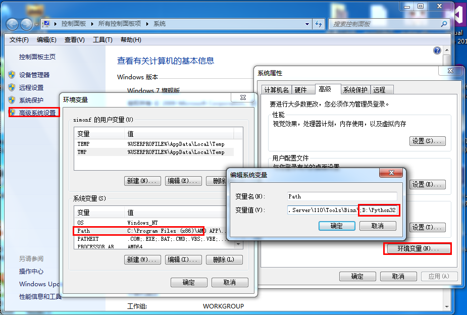
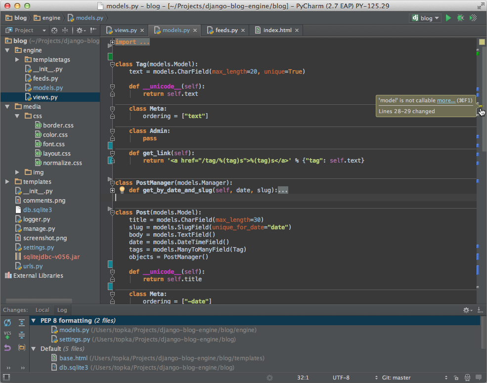

# 阿里云学院 Python 基础知识

Python是一种解释型、面向对象、动态数据类型的高级程序设计语言。

Python由Guido van Rossum于1989年底发明，第一个公开发行版发行于1991年。

像Perl语言一样, Python 源代码同样遵循 GPL(GNU General Public License)协议。

现在开始学习 Python！

##### 实例(Python 3.0+)

#!/usr/bin/python3 print("Hello, World!");

## Python 简介
Python 是一个高层次的结合了解释性、编译性、互动性和面向对象的脚本语言。

Python 的设计具有很强的可读性，相比其他语言经常使用英文关键字，其他语言的一些标点符号，它具有比其他语言更有特色语法结构。

Python 是一种解释型语言： 这意味着开发过程中没有了编译这个环节。类似于PHP和Perl语言。

Python 是交互式语言： 这意味着，您可以在一个Python提示符，直接互动执行写你的程序。

Python 是面向对象语言: 这意味着Python支持面向对象的风格或代码封装在对象的编程技术。

Python 是初学者的语言：Python 对初级程序员而言，是一种伟大的语言，它支持广泛的应用程序开发，从简单的文字处理到 WWW 浏览器再到游戏。

## Python 发展历史
Python 是由 Guido van Rossum 在八十年代末和九十年代初，在荷兰国家数学和计算机科学研究所设计出来的。

Python 本身也是由诸多其他语言发展而来的,这包括 ABC、Modula-3、C、C++、Algol-68、SmallTalk、Unix shell 和其他的脚本语言等等。

像 Perl 语言一样，Python 源代码同样遵循 GPL(GNU General Public License)协议。

现在 Python 是由一个核心开发团队在维护，Guido van Rossum 仍然占据着至关重要的作用，指导其进展。

## Python 特点
1.易于学习：Python有相对较少的关键字，结构简单，和一个明确定义的语法，学习起来更加简单。

2.易于阅读：Python代码定义的更清晰。

3.易于维护：Python的成功在于它的源代码是相当容易维护的。

4.一个广泛的标准库：Python的最大的优势之一是丰富的库，跨平台的，在UNIX，Windows和Macintosh兼容很好。

5.互动模式：互动模式的支持，您可以从终端输入执行代码并获得结果的语言，互动的测试和调试代码片断。

6.可移植：基于其开放源代码的特性，Python已经被移植（也就是使其工作）到许多平台。

7.可扩展：如果你需要一段运行很快的关键代码，或者是想要编写一些不愿开放的算法，你可以使用C或C++完成那部分程序，然后从你的Python程序中调用。

8.数据库：Python提供所有主要的商业数据库的接口。

9.GUI编程：Python支持GUI可以创建和移植到许多系统调用。

10.可嵌入: 你可以将Python嵌入到C/C++程序，让你的程序的用户获得"脚本化"的能力。

## Python 环境搭建
本章节我们将向大家介绍如何在本地搭建Python开发环境。
Python可应用于多平台包括 Linux 和 Mac OS X。
你可以通过终端窗口输入 "python" 命令来查看本地是否已经安装Python以及Python的安装版本。
Unix (Solaris, Linux, FreeBSD, AIX, HP/UX, SunOS, IRIX, 等等。)
Win 9x/NT/2000
Macintosh (Intel, PPC, 68K)
OS/2
DOS (多个DOS版本)
PalmOS
Nokia 移动手机
Windows CE
Acorn/RISC OS
BeOS
Amiga
VMS/OpenVMS
QNX
VxWorks
Psion
Python 同样可以移植到 Java 和 .NET 虚拟机上。
 

## Python下载
Python最新源码，二进制文档，新闻资讯等可以在Python的官网查看到：
Python官网：http://www.python.org/
你可以在以下链接中下载 Python 的文档，你可以下载 HTML、PDF 和 PostScript 等格式的文档。
Python文档下载地址：www.python.org/doc/
 

## Python安装
Python已经被移植在许多平台上（经过改动使它能够工作在不同平台上）。
您需要下载适用于您使用平台的二进制代码，然后安装Python。
如果您平台的二进制代码是不可用的，你需要使用C编译器手动编译源代码。
编译的源代码，功能上有更多的选择性， 为python安装提供了更多的灵活性。
以下为不同平台上安装Python的方法：
Unix &amp; Linux 平台安装 Python:
以下为在Unix &amp; Linux 平台上安装 Python 的简单步骤：
打开WEB浏览器访问http://www.python.org/download/
选择适用于Unix/Linux的源码压缩包。
下载及解压压缩包。
如果你需要自定义一些选项修改Modules/Setup
执行 ./configure 脚本
make
make install
执行以上操作后，Python会安装在 /usr/local/bin 目录中，Python库安装在/usr/local/lib/pythonXX，XX为你使用的Python的版本号。
Window 平台安装 Python:
以下为在 Window 平台上安装 Python 的简单步骤：
打开WEB浏览器访问http://www.python.org/download/
在下载列表中选择Window平台安装包，包格式为：python-XYZ.msi 文件 ， XYZ 为你要安装的版本号。
要使用安装程序 python-XYZ.msi, Windows系统必须支持Microsoft Installer 2.0搭配使用。只要保存安装文件到本地计算机，然后运行它，看看你的机器支持MSI。Windows XP和更高版本已经有MSI，很多老机器也可以安装MSI。
下载后，双击下载包，进入Python安装向导，安装非常简单，你只需要使用默认的设置一直点击"下一步"直到安装完成即可。
MAC 平台安装 Python:
最近的Macs系统都自带有Python环境，你也可以在链接 http://www.python.org/download/ 上下载最新版安装。
 

### 环境变量配置
程序和可执行文件可以在许多目录，而这些路径很可能不在操作系统提供可执行文件的搜索路径中。
path(路径)存储在环境变量中，这是由操作系统维护的一个命名的字符串。这些变量包含可用的命令行解释器和其他程序的信息。
Unix或Windows中路径变量为PATH（UNIX区分大小写，Windows不区分大小写）。
在Mac OS中，安装程序过程中改变了python的安装路径。如果你需要在其他目录引用Python，你必须在path中添加Python目录。
#### 在 Unix/Linux 设置环境变量
在 csh shell: 输入 
setenv PATH "$PATH:/usr/local/bin/python", 按下"Enter"。
在 bash shell (Linux): 输入 
export PATH="$PATH:/usr/local/bin/python"，按下"Enter"。
在 sh 或者 ksh shell: 输入 
PATH="$PATH:/usr/local/bin/python", 按下"Enter"。
注意: /usr/local/bin/python 是Python的安装目录。
#### 在 Windows 设置环境变量
在环境变量中添加Python目录：
在命令提示框中(cmd) : 输入 
path=%path%;C:\Python按下"Enter"。 
注意: C:\Python 是Python的安装目录。
也可以通过以下方式设置：
右键点击"计算机"，然后点击"属性"
然后点击"高级系统设置"
选择"系统变量"窗口下面的"Path",双击即可！
 
然后在"Path"行，添加python安装路径即可(我的D:\Python32)，所以在后面，添加该路径即可。 ps：记住，路径直接用分号"；"隔开！
最后设置成功以后，在cmd命令行，输入命令"python"，就可以有相关显示。

### Python 环境变量
下面几个重要的环境变量，它应用于Python：

变量名描述
PYTHONPATH PYTHONPATH是Python搜索路径，默认我们import的模块都会从PYTHONPATH里面寻找。 
PYTHONSTARTUP Python启动后，先寻找PYTHONSTARTUP环境变量，然后执行此文件中变量指定的执行代码。 
PYTHONCASEOK 加入PYTHONCASEOK的环境变量, 就会使python导入模块的时候不区分大小写. 
PYTHONHOME 另一种模块搜索路径。它通常内嵌于的PYTHONSTARTUP或PYTHONPATH目录中，使得两个模块库更容易切换。 
 

### 运行Python
有三种方式可以运行Python：
1、交互式解释器：
你可以通过命令行窗口进入python并开在交互式解释器中开始编写Python代码。
你可以在Unix，DOS或任何其他提供了命令行或者shell的系统进行python编码工作。
$ python # Unix/Linux 或者 C:&gt;python # Windows/DOS
以下为Python命令行参数：

选项描述
-d 在解析时显示调试信息 
-O 生成优化代码 ( .pyo 文件 ) 
-S 启动时不引入查找Python路径的位置 
-V 输出Python版本号 
-X 从 1.6版本之后基于内建的异常（仅仅用于字符串）已过时。 
-c cmd 执行 Python 脚本，并将运行结果作为 cmd 字符串。 
file 在给定的python文件执行python脚本。 
2、命令行脚本
在你的应用程序中通过引入解释器可以在命令行中执行Python脚本，如下所示：
$ python script.py # Unix/Linux 或者 C:&gt;python script.py # Windows/DOS
注意：在执行脚本时，请检查脚本是否有可执行权限。
3、集成开发环境（IDE：Integrated Development Environment）: PyCharm
PyCharm 是由 JetBrains 打造的一款 Python IDE，支持 macOS、 Windows、 Linux 系统。
PyCharm 功能 : 调试、语法高亮、Project管理、代码跳转、智能提示、自动完成、单元测试、版本控制……
PyCharm 下载地址 : https://www.jetbrains.com/pycharm/download/

继续下一章之前，请确保您的环境已搭建成功。如果你不能够建立正确的环境，那么你就可以从您的系统管理员的帮助。
在以后的章节中给出的例子已在 Python2.7.6 版本测试通过。
 
 